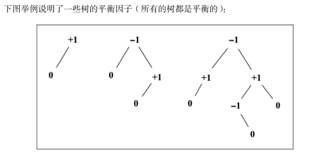
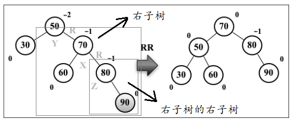
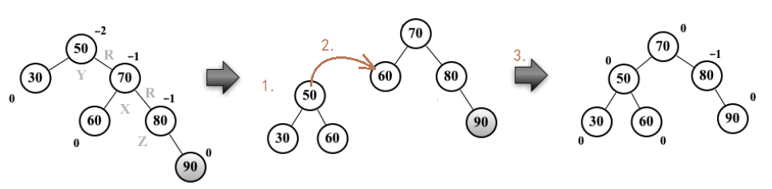
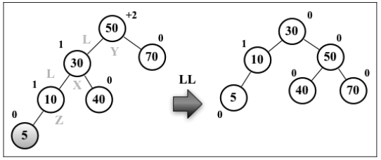
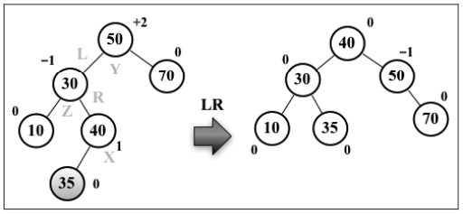
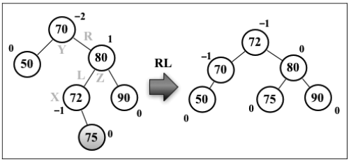

# AVL

AVL树（Adelson-Velskii-Landi 树）是一种自平衡树，其任一节点右子树和左子树高度差至多是1。

在AVL树中插入和移除节点同BST完全相同，但是需要检查AVL的平衡因子，保证AVL自平衡。

```js
class AVL extends BST {
  constructor () {
    super()
  }

  insert (value) {
    this.root = insertNode(this.root, value)
  }

  remove (value) {
    this.root = removeNode(this.root, value)
  }
}
```

下面我们逐步实现一个AVL树

## 平衡因子BF

平衡因子，balance factor，简称BF

要实现一个AVL树，首先要计算平衡因子；而计算平衡因子，就要先计算节点的高度。

**节点的平衡因子 = 节点左子树高度 - 节点右子树高度**



计算平衡因子的函数：

```js
function height(node) {
  return node === null ? 0 : Math.max(height(node.left), height(node.right)) + 1
}

function balanceFactor(node) {
  return height(node.left) - height(node.right)
}
```

## 插入

实现插入节点主要是来实现insertNode函数，AVL的insertNode只比BST的insertNode多了一个自平衡的过程，也就是下面这行代码：

```js
node = balance(node)
```

其余完全相同

```js
function insertNode(node, value) {
  if (node === null) {
    node = new Node(value)
  } else if (value < node.value) {
    node.left = insertNode(node.left, value)
  } else if (value > node.value) {
    node.right = insertNode(node.right, value)
  }
  node = balance(node)
  return node
}
```

## 自平衡

自平衡通过AVL旋转来解决，一共就4种场景：

1. 对右子树的右子树（RR）自平衡，使用RR旋转解决
2. 对左子树的左子树（LL）自平衡，LL旋转
3. 对左子树的右子树（LR）自平衡，LR旋转
4. 对右子树的左子树（RL）自平衡，RL旋转

下面分别讨论之

### rotationRR



RR一共有3步：

1. 把右子树的左边赋给待平衡的树
2. 把刚刚得到的东西赋给右子树的左边
3. 返回右子树



```js
function rotationRR(node) {
  var temp = node.right
  node.right = temp.left
  temp.left = node
  return temp
}
```

### rotationLL

rotationLL同理



```js
function rotationLL(node) {
  var temp = node.left
  node.left = temp.right
  temp.right = node
  return temp
}
```

### rotationLR

rotationLR就是先对待平衡的树的左子树做一次RR，然后再做一次LL



```js
function rotationLR(node) {
  node.left = rotationRR(node.left)
  return rotationLL(node)
}
```

### rotationRL

rotationLR就是先对待平衡的树的右子树做一次LL，然后再做一次RR



```js
function rotationRL(node) {
  node.right = rotationLL(node.right)
  return rotationRR(node)
}
```

如何判断AVL旋转的类型呢？我们考虑一个待平衡的节点，根据破坏树的平衡性（平衡因子的绝对值大于 1）的节点以及其子节点的平衡因子来判断平衡化类型，不难发现实际上有4种类型：

| 待平衡节点的BF | 左子树BF | 右子树BF | 类型 |
| -------------- | -------- | -------- | ---- |
| -2             | --       | -1       | RR   |
| -2             | --       | +1       | RL   |
| +2             | +1       | --       | LL   |
| +2             | -1       | --       | LR   |

这样自平衡函数就很容易写出来了：

```js
function balance(node) {
  if (balanceFactor(node) === -2 && balanceFactor(node.right) === -1) {
    node = rotationRR(node)
  } else if (balanceFactor(node) === -2 && balanceFactor(node.right) === 1) {
    node = rotationRL(node)
  } else if (balanceFactor(node) === 2 && balanceFactor(node.left) === 1) {
    node = rotationLL(node)
  } else if (balanceFactor(node) === 2 && balanceFactor(node.left) === -1) {
    node = rotationLR(node)
  }
  return node
}
```

## 移除

```js
function removeNode(node, value) {
  if (node === null) return null
  if (value < node.value) {
    node.left = removeNode(node.left, value)
  } else if (value > node.value) {
    node.right = removeNode(node.right, value)
  } else { // 希望移除的值 等于 当前节点的值
    if (node.left === null && node.right === null) { // 第1种情况：该节点是叶节点
      node = null
      return node
    } else if (node.left === null ^ node.right === null) { // 第2种情况：该节点有1个孩子
      if (node.left === null) {
        node = node.right
      } else {
        node = node.left
      }
    } else if (node.left !== null && node.right !== null) { // 第3种情况：该节点有2个孩子
      var replacer = minNode(node.right)
      node.value = replacer.value
      replacer = replacer.right
    }
  }
  return balance(node)
}
```

和BST不同的地方有2点：

1. 总是将右子树最小节点作为replacer
2. 需要自平衡

[代码地址](https://github.com/JiWeiZ/FEMap/blob/master/codes/%E7%AE%97%E6%B3%95%E5%92%8C%E6%95%B0%E6%8D%AE%E7%BB%93%E6%9E%84/AVL.js)

