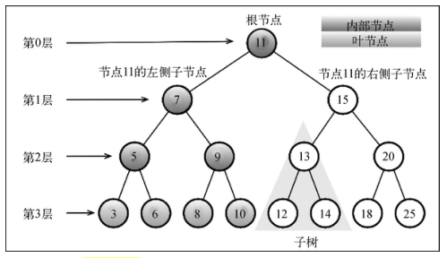
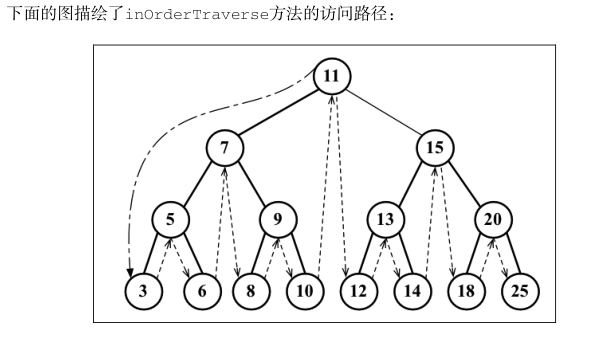
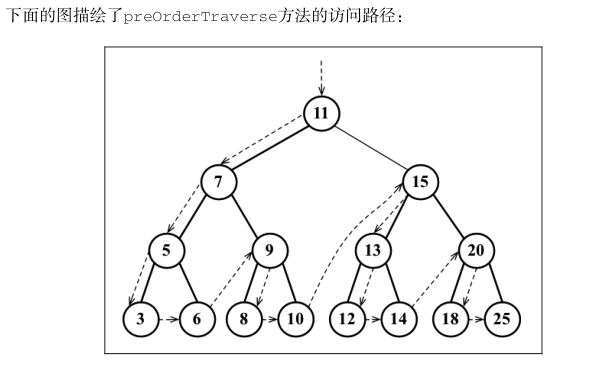
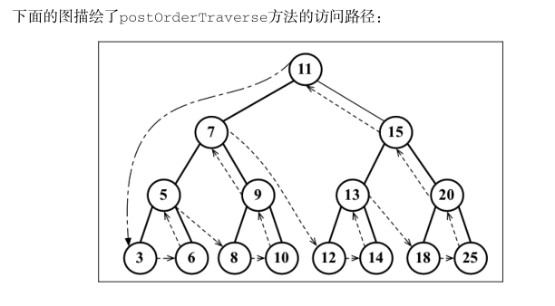

# BST

## 二叉树

1. 根节点
2. 内部节点：至少有一个子节点
3. 叶节点（外部节点）：没有子节点
4. 深度：祖先节点的数量
5. 子树：由节点和后代组成
6. 高度：节点深度最大值



## BST

BST：二叉搜索树，Binary Search Tree

二叉树进化：规定左节点比父节点小，右节点大于等于父节点

现在我们来创建BST的基本结构。

首先，一个树都是由节点组成的，每个节点有它的值、左子节点和右子节点，所以我们需要一个Node类；

```js
class Node {
  constructor (value) {
    this.value = value
    this.left = null
    this.right = null
  }
}
```

每个树都有一个根节点，当然一个树还没有声明的时候，这个根节点理应是null

```js
class BST {
  constructor () {
    this.root = null
  }
}
```

一个BST应该有下面几种方法：

1. 增：insert(key)，插入一个节点
2. 删：remove(key)，移除一个节点
3. 查：search(key)，查找一个键，如果节点存在，则返回 true ；否则返回false 。 

遍历，有3种遍历方式：

4. 中序遍历inOrderTraverse 
5. 先序遍历preOrderTraverse 
6. 后序遍历postOrderTraverse 

然后还有最值：

7. 最大值max
8. 最小值min

下面逐步实现这8个方法

```js
class BST {
  constructor() {
    this.root = null
  }

  insert(value) {
    this.root = insertNode(this.root, value)
  }

  inOrderTraverse(callback) {
    inOrderTraverseNode(this.root, callback)
  }

  preOrderTraverse(callback) {
    preOrderTraverseNode(this.root, callback)
  }

  postOrderTraverse(callback) {
    postOrderTraverseNode(this.root, callback)
  }

  min() {
    return minNode(this.root).value
  }

  max() {
    return maxNode(this.root).value
  }

  search(value) {
    return searchNode(this.root, value)
  }

  remove(value) {
    this.root = removeNode(this.root, value)
  }
}
```

## 插入

我们用一个递归函数insertNode解决问题，递归停止的条件是当前节点是空的；如果新插入的值比node的值小就在其左子树递归，否则在右子树递归

```js
function insertNode(node, value) {
  if (node === null) {
    node = new Node(value)
  } else if (value < node.value) {
    node.left = insertNode(node.left, value)
  } else {
    node.right = insertNode(node.right, value)
  }
  return node
}
```

## 遍历

1. 中序遍历是以节点值从最小到最大的顺序访问所有节点。中序遍历的一种应用就是**对树进行排序操作**。
2. 先序遍历是以优先于后代节点的顺序访问每个节点的。 先序遍历的一种应用是**打印一个结构化的文档**。
3. 后序遍历则是先访问节点的后代节点， 再访问节点本身。 后序遍历的一种应用是**计算一个目录和它的子目录中所有文件所占空间的大小**。

我们首先新建一个树，插入一些值

```js
var tree = new BST()
var arr = [11，7, 15, 5, 3, 9, 8, 10, 13, 12, 14, 20, 18, 25, 6]
arr.forEach(e => tree.insert(e))
```

### 中序遍历

```js
function inOrderTraverseNode(node, callback) {
  if (node !== null) {
    inOrderTraverseNode(node.left, callback)
    callback(node)
    inOrderTraverseNode(node.right, callback)
  }
}
```

中序遍历BST：

```js
tree.inOrderTraverse(e => console.log(e.value))
// 输出 3 5 6 7 8 9 10 11 12 13 14 15 18 20 25
```



### 先序遍历

```js
function preOrderTraverseNode(node, callback) {
  if (node !== null) {
    callback(node)
    preOrderTraverseNode(node.left, callback)
    preOrderTraverseNode(node.right, callback)
  }
}
```

先序遍历BST：

```js
tree.preOrderTraverse(e => console.log(e.value))
// 输出 11 7 5 3 6 9 8 10 15 13 12 14 20 18 25
```



### 后序遍历

```js
function postOrderTraverseNode(node, callback) {
  if (node !== null) {
    postOrderTraverseNode(node.left, callback)
    postOrderTraverseNode(node.right, callback)
    callback(node)
  }
}
```

后序遍历BST：

```js
tree.postOrderTraverse(e => console.log(e.value))
// 输出 3 6 5 8 10 9 7 12 14 13 18 25 20 15 11 
```



## 最值

### 最小

最小子节点是该node的最左叶节点

```js
function minNode(node) {
  if (node) {
    while (node && node.left !== null) {
      node = node.left
    }
    return node
  } else {
    return null
  }
}
```

### 最大

最大子节点是该node的最右叶节点

```js
function maxNode(node) {
  if (node) {
    while (node && node.right !== null) {
      node = node.right
    }
    return node
  } else {
    return null
  }
}
```

## 搜索

```js
function searchNode(node, value) {
  if (node === null) return false
  if (value < node.value) {
    return searchNode(node.left, value)
  } else if (value > node.value) {
    return searchNode(node.right, value)
  } else {
    return true
  }
}
```

## 移除

和前面的方法类似，我们仍然采用递归处理。

```js
function removeNode(node, value) {
  if (node === null) return null
  if (value < node.value) {
    node.left = removeNode(node.left, value)
  } else if (value > node.value) {
    node.right = removeNode(node.right, value)
  } else { // 希望移除的值 等于 当前节点的值
    // 第1种情况：该节点是叶节点
    // 第2种情况：该节点有1个孩子
    // 第3种情况：该节点有2个孩子
  }
  return node
}
```

第1种情况：该节点是叶节点，就直接把叶节点去掉就好了

第2种情况：该节点有1个孩子，让这个孩子取代该节点即可

第3种情况：该节点有2个孩子，这需要用该节点右子树最小节点取代之，然后移除右子树最小节点

```js
if (node.left === null && node.right === null) { // 第1种情况：该节点是叶节点
  node = null
  return node
} else if (node.left === null ^ node.right === null) { // 第2种情况：该节点有1个孩子
  if (node.left === null) {
    node = node.right
  } else {
    node = node.left
  }
} else if (node.left !== null && node.right !== null) { // 第3种情况：该节点有2个孩子
  var replacer = minNode(node)
  node.value = replacer.value
  node.right = removeNode(node.right, replacer.value)
}
```

[代码地址](https://github.com/JiWeiZ/FEMap/blob/master/codes/%E7%AE%97%E6%B3%95%E5%92%8C%E6%95%B0%E6%8D%AE%E7%BB%93%E6%9E%84/BST.js)

