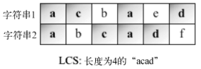
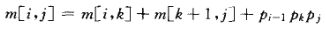
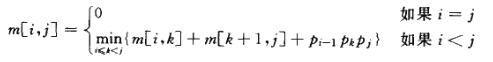
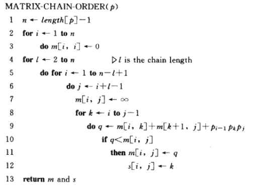
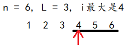

# 动态规划

## 最少硬币找零问题

最少硬币找零问题是硬币找零问题的一个变种。

硬币找零问题：给出要找零的钱数， 以及可用的硬币面额d1 …dn 及其数量， 找出有多少种找零方法；

最少硬币找零问题：给出要找零的钱数，以及可用的硬币面额d1 …dn 及其数量，找到所需的最少的硬币个数。 

例如，美国有以下面额（硬币）：d1 = 1, d2 = 5, d3 = 10, d4 = 25

如果要找36美分的零钱，我们可以用1个25美分、1个10美分和1个便士（1美分） 。

最少硬币找零的解决方案是找到n所需的最小硬币数。但要做到这一点，首先得找到对每个x<n的解。然后，我们将解建立在更小的值的解的基础上。

```js
var times = 0
function MinCoinChange(types) {
  var cache = {}
  this.makeChange = function (amount) {
    var self = this
    if (amount <= 0) return []
    if (cache[amount]) return cache[amount]
    var res = [], residualRes, residual
    for (var i = types.length - 1; i >= 0; i--) { // 从大面额开始找
      var type = types[i]
      residual = amount - type
      if (residual >= 0) {
        residualRes = self.makeChange(residual)
        if (res.length > residualRes.length + 1 || !res.length) {
            res = [type].concat(residualRes)
            // console.log(`[${res.join(', ')}] for ${amount}`)
        }
      }
    }
    cache[amount] = res
    return res
  }
}

var minCoinChange = new MinCoinChange([1, 5, 10, 25])
console.log(minCoinChange.makeChange(36))

```

MinCoinChange 类接收 types参数，该参数代表问题中的面额。对美国的硬币系统而言，它是 [1, 5, 10, 25] 。

为了更加高效且不重复计算值，我们使用了 cache

makeChange 方法是一个递归函数。res代表待返回的结果，residual代表总金额amount - type剩余的金额，而residualRes代表对residual递归之后得到的结果。显然type和residualRes合并就是我们最终想要的res

那么什么时候合并呢？有2种情况：

1. res是空的应该合并
2. res不是最优的，比如说amount = 6, types = [1, 2, 3]：
   1. 当type = 1时，res = [1, 1, 4]，继续循环
   2. 当type = 2时，residual = 4，residualRes = [4]，此时res比residualRes的至少长度大2，此时应该合并

## 0-1背包问题

0-1背包问题是一个组合优化问题。它可以描述如下：给定一个固定大小、能够携重W的背包，以及一组有价值和重量的物品，每种物品均只有一件，找出一个最佳解决方案，使得装入背包的物品总重量不超过W，且总价值最大。

| 物品# | 重量weights | 价值values |
| ----- | ----------- | ---------- |
| 0     | 2           | 3          |
| 1     | 3           | 4          |
| 2     | 4           | 5          |

考虑背包能够携带的重量只有5。对于这个例子，我们可以说最佳解决方案是往背包里装入物品1和物品2，这样，总重量为5，总价值为7。

我们需要构建一个矩阵F(i, j)来解决问题：

i代表从0到物品总数量的选择数的递增变量，比如一共有5种不同物品，i = 0就代表没有选择，i = 1就代表可以选择第一件物品， i = 2代表可以选择第1件和第2件，i = 3代表第1,2,3件都可以选...

j是从0到capacity的递增变量，F(i, j)代表可选数量为i，容量为j时的最优解

**第一步**

当j =\=\= 0时，表示背包容量为0，此时总价值必定为0；当i =\=\= 0时，没有任何选择，总价值也0

| w[i-1] | v[i-1] | i/j  | 0    | 1    | 2    | 3    | 4    | 5    |
| ------ | ------ | ---- | ---- | ---- | ---- | ---- | ---- | ---- |
|        |        | 0    | 0    | 0    | 0    | 0    | 0    | 0    |
| w0 = 2 | v0 = 3 | 1    | 0    |      |      |      |      |      |
| w1 = 3 | v1 = 4 | 2    | 0    |      |      |      |      |      |
| w2 = 4 | v2 = 5 | 3    | 0    |      |      |      |      |      |

**第二步**

i =\=\= 1时，只有1种选择，就是选择物品0。如果背包容量小于物品0的重量，F(i, j)为0；否则就是物品0的价值

| w[i-1] | v[i-1] | i/j  | 0    | 1    | 2    | 3    | 4    | 5    |
| ------ | ------ | ---- | ---- | ---- | ---- | ---- | ---- | ---- |
|        |        | 0    | 0    | 0    | 0    | 0    | 0    | 0    |
| w0 = 2 | v0 = 3 | 1    | 0    | 0    | 3    | 3    | 3    | 3    |
| w1 = 3 | v1 = 4 | 2    | 0    |      |      |      |      |      |
| w2 = 4 | v2 = 5 | 3    | 0    |      |      |      |      |      |

**第三步**

i =\=\= 2时，有2种选择，可以选择物品0，也可以选择物品1，还可以物品0和物品1都选。如果背包容量小于物品0或物品1的重量，F(i, j)为0。所以F(2, 1) = 0

F(2, 2)的价值也很简单，就是物品0的价值：

​	F(2, 2) = F(1, 2)

F(2, 3)就不一样了，此时背包容量是3，物品1的重量也是3，(即： **j >= w[i-1] **)，此时既可以选物品1，也可以不选物品1而去选物品0：

1. 如果不选物品1，F(2, 3) 就等于 F(1, 3)
2. 如果选物品1，F(2, 3) 就等于 v1

比较之后我们会选择第二种方案

| w[i-1] | v[i-1] | i/j  | 0    | 1    | 2    | 3    | 4    | 5    |
| ------ | ------ | ---- | ---- | ---- | ---- | ---- | ---- | ---- |
|        |        | 0    | 0    | 0    | 0    | 0    | 0    | 0    |
| w0 = 2 | v0 = 3 | 1    | 0    | 0    | 3    | 3    | 3    | 3    |
| w1 = 3 | v1 = 4 | 2    | 0    | 0    | 3    | 4    |      |      |
| w2 = 4 | v2 = 5 | 3    | 0    |      |      |      |      |      |

通过第3步我们可以抽象出来，如果**j >= w[i-1]**，我们即可选物品i-1也可以不选物品i-1：

1. 如果不选物品i - 1：F(i, j) = F(i -1, j)
2. 如果选物品i - 1，最高价值等于物品i -1的价值加上总容量减去物品i - 1的重量后的最高价值。也就是说确定选择物品1以后，选择数减少了1，背包容量减少了w[i - 1]，所以：F(i, j) = v[i - 1] + F[i - 1, j - w[i - 1]]

**剩下的步骤：**

搞清楚了原理，剩下的就很简单了

| w[i-1] | v[i-1] | i/j  | 0    | 1    | 2    | 3    | 4    | 5    |
| ------ | ------ | ---- | ---- | ---- | ---- | ---- | ---- | ---- |
|        |        | 0    | 0    | 0    | 0    | 0    | 0    | 0    |
| w0 = 2 | v0 = 3 | 1    | 0    | 0    | 3    | 3    | 3    | 3    |
| w1 = 3 | v1 = 4 | 2    | 0    | 0    | 3    | 4    | 4    | 7    |
| w2 = 4 | v2 = 5 | 3    | 0    | 0    | 3    | 4    | 4    | 7    |

代码如下：

```js
function backpack(capacity, w, v) {
  var F = []

  for (var i = 0; i <= v.length; i++) {
    F[i] = []
    for (var j = 0; j <= capacity; j++) {
      if (i == 0 || j == 0) {
        F[i][j] = 0;
      } else if (j < w[i - 1]) {
        F[i][j] = F[i - 1][j]
      } else {
        F[i][j] = Math.max(F[i - 1][j], v[i - 1] + F[i - 1][j - w[i - 1]])
      }
    }
  }
  return F[v.length][capacity]
}
```

上面的代码只能显示最值的最高价值，不能显示如何选择物品，我们可以改进一下：

```js
function backpack(capacity, w, v) {
  var F = []

  for (var i = 0; i <= v.length; i++) {
    F[i] = []
    for (var j = 0; j <= capacity; j++) {
      if (i == 0 || j == 0) {
        F[i][j] = {
          value: 0,
          option: []
        }
      } else if (j < w[i - 1]) {
        F[i][j] = {
          value: F[i - 1][j].value,
          option: [i - 1]
        }
      } else if (F[i - 1][j].value > v[i - 1] + F[i - 1][j - w[i - 1]].value) {
        F[i][j] = F[i - 1][j]
      } else {
        F[i][j] = {
          value: v[i - 1] + F[i - 1][j - w[i - 1]].value,
          option: F[i - 1][j - w[i - 1]].option.concat(i - 1)
        }
      }
    }
  }

  return F[v.length][capacity]
}

var v = [3, 4, 5], w = [2, 3, 4], capacity = 7
console.log(backpack(capacity, w, v)) //输出 {value: 7, option: [0, 1]}

```

## 最长公共子序列

最长公共子序列（LCS）：找出两个字符串序列的最长子序列的长度。最长子序列是指，在两个字符串序列中以相同顺序出现，但不要求连续（非字符串子串）的字符串序列。 



LCS不一定唯一。

```js
function lcs(wordX, wordY) {
  var res = []

  for (var i = 0; i <= wordX.length; i++) {
    res[i] = []
    for (var j = 0; j <= wordY.length; j++) {
      if (i == 0 || j == 0) {
        res[i][j] = ''
      } else if (wordX[i - 1] == wordY[j - 1]) {
        res[i][j] = res[i - 1][j - 1] + wordX[i - 1]
      } else if (res[i - 1][j].length > res[i][j - 1].length) {
        res[i][j] = res[i - 1][j]
      } else {
        res[i][j] = res[i][j - 1]
      }
    }
  }
  return res[wordX.length][wordY.length]
}
console.log(lcs('acbaed', 'abcadf'))
console.log(lcs('abcadf', 'acbaed'))

```

## 矩阵链相乘

考虑如下情况： 

1. A1是一个10行100列的矩阵
2. A2是一个100行5列的矩阵
3. A3是一个5行50列的矩阵
4. A4是一个50行1列的矩阵 
5. A1\*A2\*A3\*A4的结果是一个10行1列的矩阵 

在这个例子里，相乘的方式有五种。

1. (A1(A2(A3A4)))：乘法运算的次数是1750次。
2. ((A1A2)(A3A4))：乘法运算的次数是5300次。
3. (((A1A2)A3)A4)：乘法运算的次数是8000次。
4. ((A1(A2A3))A4)：乘法运算的次数是75 500次。
5. (A1((A2A3)A4))：乘法运算的次数是31 000次。

相乘的顺序不一样，要进行的乘法运算总数也有很大差异。那么，要如何构建一个算法，求出最少的乘法运算操作次数呢？

定义：

1. Ai是p(i-1) * pi维矩阵
2. M[i, j] 为 Ai \* A(i+1) \* ... \* Aj 的最少相乘数，如M12代表A1 \*A2的最少相乘数，M24代表A2 \* A3 \* A4的最少相乘数。

动态规划的一个思想是要寻找最优子结构，所以将 M[i, j] 分为2部分：M[i, k] 和 M[k+1, j]，于是有：



上面这个公式假设我们已知k是多少，实际上我们并不知道，所以必须从 i 到 j 逐个检查 k 的值，于是有：



伪代码如下：



1. 首先M[i, i]链的长度为0，此时M[i, i] = 0 （2, 3行）

2. 然后矩阵链的长度L从2开始计算，到总长度n结束（第4行）

3. 当矩阵链的长度为L时，i的取值范围就是[1, n - L + 1]（第5行）
   

   j的值是矩阵链尾部索引，j - i等于L - 1，故j = i + L - 1

4. 由于我们不知道 M[i, j] 的值怎么选，所以给他一个无穷大值，将后来通过比较（第10行）再修改之

JS代码如下：

```js
function matrixChainOrder(p) {
  var n = p.length - 1
  var m = []
  for (var i = 1; i <= n; i++) {
    m[i] = []
    m[i][i] = 0
  }

  for (var L = 2; L <= n; L++) {
    for (var i = 1; i <= n - L + 1; i++) {
      var j = i + L - 1
      m[i][j] = Number.MAX_SAFE_INTEGER;
      for (var k = i; k <= j - 1; k++) {
        var q = m[i][k] + m[k + 1][j] + p[i - 1] * p[k] * p[j] //{1}
        if (q < m[i][j]) {
          m[i][j] = q
        }
      }
    }
  }
  return m[1][n]
}
```

下面详细说明算法过程。回到上面的例子，p = [10,100,5,50,1]
#### 补0循环结束后

第一个for循环结束后，m矩阵是这个样子

| i/j  | 0     | 1     | 2     | 3     | 4     |
| ---- | ----- | ----- | ----- | ----- | ----- |
| 0    | empty | empty | empty | empty | empty |
| 1    | empty | 0     |       |       |       |
| 2    | empty | empty | 0     |       |       |
| 3    | empty | empty | empty | 0     |       |
| 4    | empty | empty | empty | empty | 0     |

#### 矩阵链L长度为2

i = 1时，j = 2 + 1 - 1 = 2

M[1, 2] = ∞，进入关于k的循环，k ∈ [1, 1]<br/>
当k = 1时，计算q的值：<br/>
q = M[1, 1] + M[2, 2] + p[0] * p[1] * p[2] = 0 + 0 + 10 * 100 * 5 = 5000<br/>
比较q和M[1, 2]的值，M[1, 2] = ∞<br/>
显然q < M[1, 2]，于是得M[1, 2] = 5000<br/>

 i = 2时，j = 2 + 2 - 1 = 3

M[2, 3] = ∞，进入关于k的循环，k ∈ [2, 2]<br/>
当k = 2时，计算q的值：<br/>
q = M[2, 2] + M[3, 3] + p[1] * p[2] * p[3] = 0 + 0 + 100 * 5 * 50 = 25000<br/>
比较q和M[2, 3]的值，M[2, 3] = ∞<br/>
显然q < M[2, 3]，于是得M[2, 3] = 25000<br/>

i = 3时，j = 2 + 3 - 1 = 4

M[3, 4] = ∞，进入关于k的循环，k ∈ [3, 3]<br/>
当k = 3时，计算q的值：<br/>
q = M[3, 3] + M[4, 4] + p[2] * p[3] * p[4] = 0 + 0 + 5 * 50 * 1 = 250<br/>
比较q和M[3, 4]的值，M[3, 4] = ∞<br/>
显然q < M[3, 4]，于是得M[3, 4] = 250<br/>

| i/j  | 0     | 1     | 2     | 3     | 4     |
| ---- | ----- | ----- | ----- | ----- | ----- |
| 0    | empty | empty | empty | empty | empty |
| 1    | empty | 0     | 5000  |       |       |
| 2    | empty | empty | 0     | 25000 |       |
| 3    | empty | empty | empty | 0     | 250   |
| 4    | empty | empty | empty | empty | 0     |

#### 矩阵链L长度为3

i = 1时，j = 3 + 1 - 1 = 3

M[1, 3] = ∞，进入关于k的循环，k ∈ [1, 2]<br/>
当k = 1时，计算q的值：<br/>
q = M[1, 1] + M[2, 3] + p[0] * p[1] * p[3] = 0 + 25000 + 10 * 100 * 50 = 75000<br/>
比较q和M[1, 3]的值，M[1, 3] = ∞<br/>
显然q < M[1, 3]，于是得M[1, 3] = 75000<br/>

当k = 2时，计算q的值：<br/>
q = M[1, 2] + M[3, 3] + p[0] * p[2] * p[3] = 5000 + 0 + 10 * 5 * 50 = 7500<br/>
比较q和M[1, 3]的值，M[1, 3] = 75000<br/>
显然q < M[1, 3]，于是得M[1, 3] = 7500<br/>

 i = 2时，j = 3 + 2 - 1 = 4

M[2, 4] = ∞，进入关于k的循环，k ∈ [2, 3]<br/>
当k = 2时，计算q的值：<br/>
q = M[2, 2] + M[3, 4] + p[1] * p[2] * p[4] = 0 + 250 + 100 * 5 * 1 = 750<br/>
比较q和M[2, 4]的值，M[2, 4] = ∞<br/>
显然q < M[2, 4]，于是得M[2, 4] = 750<br/>

当k = 3时，计算q的值：<br/>
q = M[2, 3] + M[4, 4] + p[1] * p[3] * p[4] = 25000 + 0 + 100 * 50 * 1 = 30000<br/>
比较q和M[2, 4]的值，M[2, 4] = 750<br/>
显然q >= M[2, 4]，于是得M[2, 4] = 750<br/>

| i/j  | 0     | 1     | 2     | 3     | 4     |
| ---- | ----- | ----- | ----- | ----- | ----- |
| 0    | empty | empty | empty | empty | empty |
| 1    | empty | 0     | 5000  | 7500  |       |
| 2    | empty | empty | 0     | 25000 | 750   |
| 3    | empty | empty | empty | 0     | 250   |
| 4    | empty | empty | empty | empty | 0     |

#### 矩阵链L长度为4

 i = 1时，j = 4 + 1 - 1 = 4

M[1, 4] = ∞，进入关于k的循环，k ∈ [1, 3]<br/>
当k = 1时，计算q的值：<br/>
q = M[1, 1] + M[2, 4] + p[0] * p[1] * p[4] = 0 + 750 + 10 * 100 * 1 = 1750<br/>
比较q和M[1, 4]的值，M[1, 4] = ∞<br/>
显然q < M[1, 4]，于是得M[1, 4] = 1750<br/>

当k = 2时，计算q的值：<br/>
q = M[1, 2] + M[3, 4] + p[0] * p[2] * p[4] = 5000 + 250 + 10 * 5 * 1 = 5300<br/>
比较q和M[1, 4]的值，M[1, 4] = 1750<br/>
显然q >= M[1, 4]，于是得M[1, 4] = 1750<br/>

当k = 3时，计算q的值：<br/>
q = M[1, 3] + M[4, 4] + p[0] * p[3] * p[4] = 7500 + 0 + 10 * 50 * 1 = 8000<br/>
比较q和M[1, 4]的值，M[1, 4] = 1750<br/>
显然q >= M[1, 4]，于是得M[1, 4] = 1750<br/>

| i/j  | 0     | 1     | 2     | 3     | 4     |
| ---- | ----- | ----- | ----- | ----- | ----- |
| 0    | empty | empty | empty | empty | empty |
| 1    | empty | 0     | 5000  | 7500  | 1750  |
| 2    | empty | empty | 0     | 25000 | 750   |
| 3    | empty | empty | empty | 0     | 250   |
| 4    | empty | empty | empty | empty | 0     |

 最后输出的结果是M[1，n]，即M[1, 4] = 1750