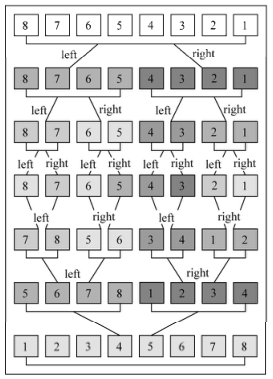
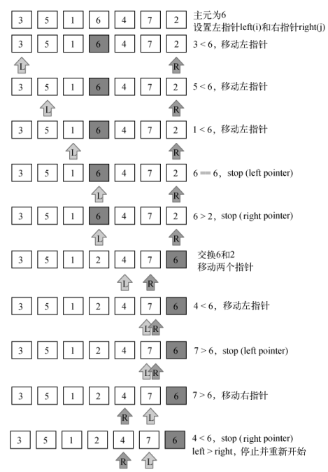
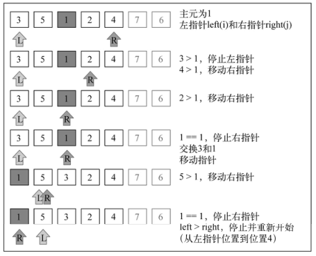
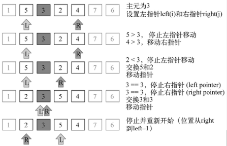
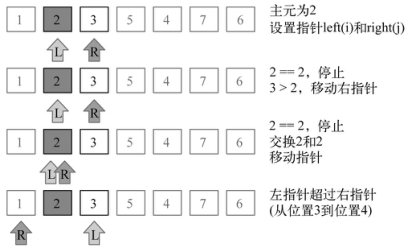
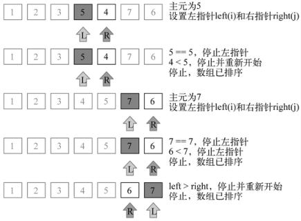

# 排序算法

常用排序算法及其复杂度


下面分别介绍之，均以顺序排序为例

## 冒泡排序

大致思路：外循环len次，内循环len - 1 - i次，然后前一个比后一个大就交换

```js
var arr = [6, 7, 0, 4, 1, 5, 3, 2]

function bubbleSort(arr) {
  var len = arr.length
  for (var i = 0; i < len; i++) {
    for (var j = 0; j < len - 1 - i; j++) {
      if (arr[j] > arr[j + 1]) {
        [arr[j], arr[j + 1]] = [arr[j + 1], arr[j]]
      }
    }
  }
  return arr
}

console.log(bubbleSort(arr))

```

## 选择排序

大致思路：遍历整个数组，从当前元素及其所有后续元素中找到一个最小的，二者交换。

```js
var arr = [6, 7, 0, 4, 1, 5, 3, 2]

function selectSort(arr) {
  var len = arr.length, idxMin
  for (var i = 0; i < len - 1; i++) {
    idxMin = i
    for (var j = i; j < len; j++) {
      if (arr[idxMin] > arr[j]) idxMin = j
    }
    if (i !== idxMin) {
      [arr[i], arr[idxMin]] = [arr[idxMin], arr[i]]
    }
  }
  return arr
}

console.log(selectSort(arr))

```

## 插入排序

大致思路：从第二个位置（索引 1 ）而不是 0 位置开始的（我们认为第一项已排序了） ，然后不断while循环直到找到正确的插入位置

```js
var arr = [6, 7, 0, 4, 1, 5, 3, 2]

function insertSort(arr) {
  var len = arr.length, j, current
  for (var i = 1; i < len; i++) {
    [j, current] = [i, arr[i]]
    while (j > 0 && arr[j - 1] > current) {
      arr[j] = arr[j - 1]
      j--
    }
    if (j !== i) arr[j] = current
  }
  return arr
}

console.log(insertSort(arr))

```
**下面简单表示一下排序过程：**

未排序<br/>
67041532<br/>
i = 1, current = 7<br/>
67041532<br/>
i = 2, current = 0<br/>
67741532<br/>
66741532<br/>
06741532<br/>
i = 3, current = 4<br/>
06771532<br/>
06671532<br/>
04671532<br/>
i = 4, current = 1<br/>
04677532<br/>
04667532<br/>
04467532<br/>
01467532<br/>
i = 5, current = 5<br/>
01467732<br/>
01466732<br/>
01456732<br/>
i = 6, current = 3<br/>
01456772<br/>
01456672<br/>
01455672<br/>
01445672<br/>
01345672<br/>
i = 7, current = 2<br/>
01345677<br/>
01345667<br/>
01345567<br/>
01344567<br/>
01334567<br/>
01234567<br/>

## 归并排序

归并排序是第一个可以被实际使用的排序算法。前三个排序算法性能不好，但归并排序性能不错，其复杂度为O(nlogn )。

归并排序是一种分治算法。 其思想是：

1. 将原始数组切分成较小的数组， 直到每个小数组只有一个位置
2. 然后将小数组归并成较大的数组，直到最后只有一个排序完毕的大数组

由于是分治法，归并排序是递归的，我们声明一个mergeSortRec作为递归函数

```js
function mergeSortRec (arr) {
  var len = arr.length
  if (len === 1) return arr
  var midIdx = Math.floor(len / 2),
      leftArr = arr.slice(0, midIdx),
      rightArr = arr.slice(midIdx, len)
  return merge(mergeSortRec(leftArr), mergeSortRec(rightArr))
}
```

递归停止的条件是该数组长度为1。如果长度比1大就将数组从中间一分为2，分别递归处理左右两部分，然后使用一个叫merge的函数合并之。merge 函数接受两个数组作为参数，并将它们归并至一个大数组。排序发生在归并过程中。

```js
function merge(left, right) {
  var result = [], il = 0, ir = 0

  while (il < left.length && ir < right.length) {
    if (left[il] < right[ir]) {
      result.push(left[il++])
    } else {
      result.push(right[ir++])
    }
  }

  while (il < left.length) {
    result.push(left[il++])
  }

  while (ir < right.length) {
    result.push(right[ir++])
  }

  return result
}
```

首先， 需要声明归并过程要创建的新数组result以及用来迭代两个数组 （ left 和 right ） 所需的两
个变量il和ir。 

第一次循环比较来自 left 数组的项是否比来自 right 的项小。 如果是， 将该项从 left 数组添加至归并结果数组，并递增il；否则，从 right 数组添加项并递增ir 。 

第一次循环结束以后，必定有一个数组完全遍历，另一个数组还剩有元素未遍历。所以第二次循环只在发生在left或right中的一个。我们只需要将其依次添加到result中即可

```js
var arr = [6, 7, 0, 4, 1, 5, 3, 2]

function mergeSort(arr) {

  function merge(left, right) {
    var result = [], il = 0, ir = 0

    while (il < left.length && ir < right.length) {
      if (left[il] < right[ir]) {
        result.push(left[il++])
      } else {
        result.push(right[ir++])
      }
    }

    while (il < left.length) {
      result.push(left[il++])
    }

    while (ir < right.length) {
      result.push(right[ir++])
    }

    return result
  }

  function mergeSortRec(arr) {
    var len = arr.length
    if (len === 1) return arr
    var midIdx = Math.floor(len / 2),
      leftArr = arr.slice(0, midIdx),
      rightArr = arr.slice(midIdx, len)
    return merge(mergeSortRec(leftArr), mergeSortRec(rightArr))
  }
  return mergeSortRec(arr)
}

console.log(mergeSort(arr))

```

下图是归并排序的执行过程：



## 快速排序

```js
function quickSortRec (arr, il, ir) {
  var i
  if (arr.length > 1) {
    i = partition(arr, il, ir)
    if (il < i - 1) quickSortRec(arr, il, i - 1)
    if (ir > i) quickSortRec(arr, i, ir)
  }
  return arr
}

```

划分过程

```js
function partition(arr, il, ir) {
  var pivot = arr[Math.floor((il + ir) / 2)]

  while (il <= ir) {
    while(arr[il] < pivot) {
      il++
    }

    while(arr[ir] > pivot) {
      ir--
    }

    if (il <= ir) {
      [arr[il], arr[ir]] = [arr[ir], arr[il]]
      il++
      ir--
    }
  }
  return il
}
```

第一件要做的事情是选择主元（ pivot ），有好几种方式。最简单的一种是选择数组的第一项（最左项） 。然而，研究表明对于几乎已排序的数组，这不是一个好的选择，它将导致该算法的最差表现。另外一种方式是随机选择一个数组项或是选择中间项。 在本实现中，我们选择中间项作为主元。

只要左指针和右指针没有交错，就执行划分。

1. 首先，**不断移动左指针，直到找到一个 ≥ 主元的值**
2. 然后，**不断移动右指针，直到找到一个 ≤ 主元的值**

经过这样的循环，最终结果一定是（为了叙述方便，下面我们把左指针指向的元素简称左项，右指针指向的元素简称右项）：

​	左项＞主元，右项 < 主元，即 **左项 ＞ 右项**

如果这个时候左指针还小于右指针，**说明大的值在小的值左边，此时将二者交换**

交换之后继续移动左指针和右指针，直到左指针大于右指针结束循环

代码如下
```js
var arr = [6, 7, 0, 4, 1, 5, 3, 2]
function quickSort(arr) {

  function partition(arr, il, ir) {
    var pivot = arr[Math.floor((il + ir) / 2)]

    while (il <= ir) {
      while(arr[il] < pivot) {
        il++
      }

      while(arr[ir] > pivot) {
        ir--
      }

      if (il <= ir) {
        [arr[il], arr[ir]] = [arr[ir], arr[il]]
        il++
        ir--
      }
    }
    return il
  }

  function quickSortRec (arr, il, ir) {
    var i
    if (arr.length > 1) {
      i = partition(arr, il, ir)
      if (il < i - 1) quickSortRec(arr, il, i - 1)
      if (ir > i) quickSortRec(arr, i, ir)
    }
    return arr
  }

  return quickSortRec(arr, 0, arr.length - 1)
}

console.log(quickSort(arr))

```

下面是快排的执行过程












