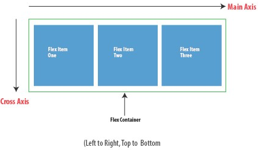
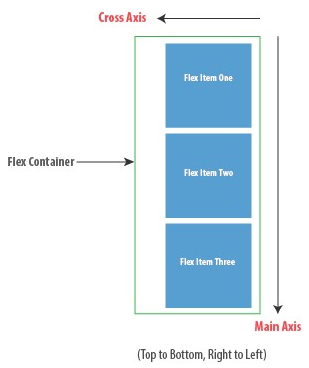

# CSS3: flex

## 简介

Flex容器，即应用display:flex;或display: inline-flex规则的元素，可以接受如下属性：

- flex-direction：指定主轴方向是水平还是垂直
- flex-wrap：指定可伸缩项是否折行
- flex-flow：以上两个属性的简写形式
- justify-content：指定可伸缩项在**主轴方向上的对齐方式**
- align-items：指定可伸缩项**在侧轴方向上的对齐方式**
- align-content：指定**多行**可伸缩项**在侧轴方向上的对齐方式**

容器的直接子元素或者可伸缩项，可以接受如下属性：

- flex-grow：指定当前项如何扩展
- flex-shrink：指定当前项如何收缩
- flex-basis：指定分配剩余空间之前当前项的初始大小
- flex：以上三个属性的简写形式
- order：规定了可伸缩项在布局时的顺序。元素按照 order 属性的值的增序进行布局。拥有相同 order 属性值的元素按照它们在源代码中出现的顺序进行布局。
- align-self：对齐当前 flex 行中的 flex 元素，并覆盖 align-items的值。如果任何 flex 元素的侧轴方向 margin 值设置为 auto，则会忽略align-self。

## 基础知识

flex盒子中没有高度和宽度的概念，因为flex没有上下左右，只有主轴侧轴


| [`flex-direction`](https://developer.mozilla.org/zh-CN/docs/Web/CSS/flex-direction) | [`align-content`](https://developer.mozilla.org/zh-CN/docs/Web/CSS/align-content) | [`flex-basis`](https://developer.mozilla.org/zh-CN/docs/Web/CSS/flex-basis) |
| ------------------------------------------------------------ | ------------------------------------------------------------ | ------------------------------------------------------------ |
| [`flex-wrap`](https://developer.mozilla.org/zh-CN/docs/Web/CSS/flex-wrap) | [`align-items`](https://developer.mozilla.org/zh-CN/docs/Web/CSS/align-items) | [`flex`](https://developer.mozilla.org/zh-CN/docs/Web/CSS/flex) |
| [`flex-flow`](https://developer.mozilla.org/zh-CN/docs/Web/CSS/flex-flow) | [`flex-grow`](https://developer.mozilla.org/zh-CN/docs/Web/CSS/flex-grow) | [`order`](https://developer.mozilla.org/zh-CN/docs/Web/CSS/order) |
| [`justify-content`](https://developer.mozilla.org/zh-CN/docs/Web/CSS/justify-content) | [`flex-shrink`](https://developer.mozilla.org/zh-CN/docs/Web/CSS/flex-shrink) | [`align-self`](https://developer.mozilla.org/zh-CN/docs/Web/CSS/align-self) |

### flex-direction

定义主轴方向

```
row| row-reverse| column| column-reverse
```

**row**



**column**<br/>

**注意侧轴方向！**



### flex-wrap

```
nowrap | wrap | wrap-reverse
```

### flex-flow

flex-direction和flex-wrap简写形式

### justify-content

定义主轴的对齐方式

### align-items

定义侧轴对齐方式，默认stretch

### align-content

如果项目只有一根轴线，该属性不起作用。

<iframe width="100%" height="310" src="//jsfiddle.net/happysir/f4qo6Lca/41/embedded/result/" allowfullscreen="allowfullscreen" allowpaymentrequest frameborder="0"></iframe>

### flew-grow

定义弹性盒子项（flex item）的拉伸因子（容器空间多余时如何放大）

### flex-shrink

定义弹性盒子项（flex item）的收缩因子（容器没有空间时如何缩小）

### flex-basis

定义项目在主轴方向上的初始大小。如果不使用 box-sizing 来改变盒模型的话，那么这个属性就决定了 flex 元素的内容盒（content-box）的宽或者高（取决于主轴的方向）的尺寸大小。

1. auto（默认值）：
   当前项如果明确指定宽度，就使用这个宽度；如果没有，就使用包含的内容决定宽度
2. content：
   不管当前项是否指定宽度，一律以内容决定宽度
3. 长度或百分比：
   百分比是相对于容器而言的，优先级大于width或height

### flex

flex属性是flex-grow, flex-shrink 和 flex-basis的简写，默认值为 0 1 auto。

| flex简写   | 等价于         |
| ---------- | -------------- |
| flex: auto | flex: 1 1 auto |
| flex: none | flex: 0 0 auto |
| flex: 1    | flex: 1 1 0    |
| flex: 2    | flex: 2 1 0    |

### align-self

对齐当前 flex 行中的 flex 元素，并覆盖 align-items 的值。 如果任何 flex 元素的侧轴方向 margin 值设置为 auto，则会忽略 align-self。

## 容器空间的分配过程

宽度分配过程分为2步，第1步确定所有项的宽度总和，第2步对剩余空间进行再分配

------

### 第一步：计算项目总空间

第1步依赖flex-basis属性，它决定项目在容器中的初始大小，有3种属性值：

1. auto：
   1. 如果当前项目有明确设置宽度，则使用该宽度；
   2. 否则，以包含的内容决定宽度
2. content<br/>不论有没有明确设置宽度，一律以内容决定宽度（屏蔽width）
3. 长度或百分比
   1. 长度就是字面意思
   2. 百分比是相对于容器而言的

根据以上规则知道了每一项的宽度，简单相加就能得到所有项宽度的总和。而知道了所有项宽度的总和，再与容器宽度比较，就能知道容器里是不是还有剩余空间可供再次分配。这里有三种情况：

1. 所有项宽度总和等于容器宽度，剩余空间为零
2. 所有项宽度总和小于容器宽度，剩余空间为正
3. 所有项宽度总和大于宽度宽度，剩余空间为负

其中，剩余空间为正，代表有剩余空间可分配，也就是可伸缩项有条件扩展。至于如何扩展，那就要看每一项的flex-grow属性了。

而剩余空间为负，代表可伸缩项宽度总和超出了容器宽度，也就是可伸缩项必须收缩才能适应容器宽度。至于如何收缩，就得看每一项的flex-shrink属性。

### 第二步：分配剩余空间

分配剩余空间的哲学就是有钱大家平分，没钱勒紧裤腰带

如果容器内有剩余空间可供再次分配，那就看每一项的flex-grow属性。flex-grow的值必须是正整数，默认值为0。

> 当前项可分得的剩余空间 = ( 当前项flex-grow值/所有项flex-grow值之和 ) * 剩余总宽度 

默认值为0，就意味着不扩展。如果每一项的flex-grow都是0，那么空地儿就空着了。

flex-grow的值就相当于权重，根据权重分配剩余空间

如果所有项宽度之和大于容器宽度，说明出现了负空间。此时，需要根据每一项的flex-shrink值决定如何收缩，以适应容器宽度。

与flex-grow一样，flex-shrink也只接受正整数值，但是它的默认值是1，也就是说默认每一项都会收缩。

再次但是，注意，与flex-grow在扩展时简单地按比例分配不同，flex-shrink的收缩算法会稍微复杂一些，公式如下：

> 当前项收缩的宽度 = ( 当前项flex-shrink  \*当前项flex-basis / 所有项flex-shrink\*  与各自flex-basis乘积之和 ) * 需收缩的总宽度

这也是按比例收缩，只是在计算比例的分子分母时，除考虑flex-shrink本身，也要考虑flex-basis。假设每一项flex-shrink都是默认值1，那其实就是按照每一项flex-basis的占比进行收缩。


[高清大图](https://s1.ssl.qhres.com/static/4e975595aab09707.svg)

## 绝对平均化

flex-basis如果是除了0之外其他值，就会经历空间分配的第一阶段，空间的内容宽度就会起作用

flex-basis一旦设置为0，就会完全跳过空间分配的第一阶段，直接进入第二阶段，此时完全依靠flex-grow和flex-shrink。利用这一点，可以实现各伸缩项宽度的绝对平均化。 

所以有人把flex-basis:0的项目叫作绝对flex项目，相应的，flex-basis不是0的项目叫作相对flex项目

```html
// 相对flex项目
<div style="display:flex">
  <div style="height:30px;background:#0cc;border:1px solid #000;flex:1"></div>
  <div style="height:30px;background:#0cc;border:1px solid #000;flex:1"></div>
</div>
```

<div style="display:flex">
  <div style="height:30px;background:#0cc;border:1px solid #000;flex:1"></div>
  <div style="height:30px;background:#0cc;border:1px solid #000;flex:1"></div>
</div>

## margin: auto对齐

在flex项目上使用 margin: auto 时，值为 auto 的方向（左、右或者二者都是）会占据所有剩余空间。

```html
<div style="display:flex;padding: 10px;margin:10px 0;background: #cc0;">
  <div style="height:30px;width:50px;margin-right:10px;background:#0cc;border:1px solid #000;"></div>
  <div style="height:30px;width:50px;margin-right:10px;background:#0cc;border:1px solid #000;"></div>
  <div style="height:30px;width:50px;margin-right:10px;background:#0cc;border:1px solid #000;"></div>
  <div style="height:30px;width:50px;margin-right:10px;background:#0cc;border:1px solid #000;"></div>
  <div style="height:30px;width:50px;background:#0cc;border:1px solid #000;"></div>
</div>

<div style="display:flex;padding: 10px;margin:10px 0;background: #cc0;">
  <div style="height:30px;width:50px;margin-right:auto;background:#0cc;border:1px solid #000;"></div>
  <div style="height:30px;width:50px;margin-right:10px;background:#0cc;border:1px solid #000;"></div>
  <div style="height:30px;width:50px;margin-right:10px;background:#0cc;border:1px solid #000;"></div>
  <div style="height:30px;width:50px;margin-right:10px;background:#0cc;border:1px solid #000;"></div>
  <div style="height:30px;width:50px;background:#0cc;border:1px solid #000;"></div>
</div>

<div style="display:flex;padding: 10px;margin:10px 0;background: #cc0;">
  <div style="height:30px;width:50px;margin-right:10px;background:#0cc;border:1px solid #000;"></div>
  <div style="height:30px;width:50px;margin-right:10px;background:#0cc;border:1px solid #000;"></div>
  <div style="height:30px;width:50px;margin:auto;background:#0cc;border:1px solid #000;"></div>
  <div style="height:30px;width:50px;margin-right:10px;background:#0cc;border:1px solid #000;"></div>
  <div style="height:30px;width:50px;background:#0cc;border:1px solid #000;"></div>
</div>
```

<div style="display:flex;padding: 10px;margin:10px 0;background: #cc0;">
  <div style="height:30px;width:50px;margin-right:10px;background:#0cc;border:1px solid #000;"></div>
  <div style="height:30px;width:50px;margin-right:10px;background:#0cc;border:1px solid #000;"></div>
  <div style="height:30px;width:50px;margin-right:10px;background:#0cc;border:1px solid #000;"></div>
  <div style="height:30px;width:50px;margin-right:10px;background:#0cc;border:1px solid #000;"></div>
  <div style="height:30px;width:50px;background:#0cc;border:1px solid #000;"></div>
</div>
<div style="display:flex;padding: 10px;margin:10px 0;background: #cc0;">
  <div style="height:30px;width:50px;margin-right:auto;background:#0cc;border:1px solid #000;"></div>
  <div style="height:30px;width:50px;margin-right:10px;background:#0cc;border:1px solid #000;"></div>
  <div style="height:30px;width:50px;margin-right:10px;background:#0cc;border:1px solid #000;"></div>
  <div style="height:30px;width:50px;margin-right:10px;background:#0cc;border:1px solid #000;"></div>
  <div style="height:30px;width:50px;background:#0cc;border:1px solid #000;"></div>
</div>
<div style="display:flex;padding: 10px;margin:10px 0;background: #cc0;">
  <div style="height:30px;width:50px;margin-right:10px;background:#0cc;border:1px solid #000;"></div>
  <div style="height:30px;width:50px;margin-right:10px;background:#0cc;border:1px solid #000;"></div>
  <div style="height:30px;width:50px;margin:auto;background:#0cc;border:1px solid #000;"></div>
  <div style="height:30px;width:50px;margin-right:10px;background:#0cc;border:1px solid #000;"></div>
  <div style="height:30px;width:50px;background:#0cc;border:1px solid #000;"></div>
</div>

## flex-basis和width优先级

### 块级元素

**flex-basis:200px;和width:50px，听谁的？**

听flex-basis:200px的

**width: auto内容长度比 flex-basis大**

flex-item content以内容长度来决定，且无法shrink

### 行内替换元素

flex容器内的图片宽度不会默认影响图片高度

flex-basis和width都存在，取flex-basis和width的最大值

如果flex-basis不是auto，width最大是图片原图片宽度

## 动手练习

## 参考

[阮一峰flex教程](http://www.ruanyifeng.com/blog/2015/07/flex-grammar.html)

[理解flex](https://www.w3cplus.com/css3/understanding-flexbox-everything-you-need-to-know.html)

[深入理解flex](https://www.w3cplus.com/css3/flexbox-layout-and-calculation.html)

[奇舞周刊flex教程](https://mp.weixin.qq.com/s?__biz=MzA5NzkwNDk3MQ==&mid=2650587826&idx=1&sn=785aa994a3f046f55c21b2c147863967&chksm=8891d296bfe65b80752f94005ee3cc6c53edc8b4f3e425e1c183ee01bba1e4688c1839e07ede&mpshare=1&scene=23&srcid=0812EwKCQn6zlmyGfW8nG3Ky#rd)

[Flexbox青蛙游戏](https://flexboxfroggy.com/) 