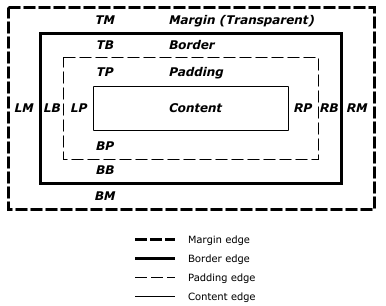

# 基本视觉格式化

## 元素框

1. 元素框包括：外边距，边框，内边距，内容区；
2. 外边距margin是`外边界`和`外边框`之间的距离
3. 边框border是`外边框`和`内边框`之间的距离
4. 内边距padding是`内边框`和`内边界`之间的距离
5. 默认情况下（box-sizing是content-box），宽度width和高度height指内容区的宽高
6. 只有margin可以设置为负
7. border不可以设为百分数
8. 没有设置border-sytle，则border为0
9. border的颜色如果没有指定，将取元素内容的前景色：比如字体是红色，那么border就是红色

来一张MDN上的图



## 包含块

包含块是元素的布局上下文，非常重要。

1. position是static或relative：由最近的`祖先块元素`或`格式化上下文`的**content edge**构成
   1. 祖先块元素：如inline-block, block 或 list-item元素
   2. 格式化上下文：如table container, flex container, grid container, 或block container
2. position是absolute：由非static的祖先元素的**padding edge**构成
3. position是fixed：视口
4. position是absolute或fixed时，其包含块还可以由满足以下条件的最近祖先元素的**padding edge**构成：
   1. transform属性不是none
   2. perspective属性不是none
   3. filter属性不是none

也就是说，position: fixed元素使用top和left定位不一定是相对于视口的

### 示例1

<iframe width="100%" height="240" src="//jsfiddle.net/happysir/vfmqd3ku/2/embedded/html,css,result/" allowfullscreen="allowfullscreen" allowpaymentrequest frameborder="0"></iframe>

<iframe width="100%" height="240" src="//jsfiddle.net/happysir/vfmqd3ku/3/embedded/html,css,result/" allowfullscreen="allowfullscreen" allowpaymentrequest frameborder="0"></iframe>

### 示例2

<iframe width="100%" height="450" src="//jsfiddle.net/happysir/s9q645ug/embedded/html,css,result/" allowfullscreen="allowfullscreen" allowpaymentrequest frameborder="0"></iframe>

## 块级格式化上下文(BFC)

如下会创建BFC：

1. **根元素**
2. **overflow不是visible的元素**
3. **浮动元素（float不是none）**
4. **绝对定位元素：position: absolute或fixed**
5. display: inline-block
6. display: flow-root
7. display: flex, inline-flex
8. display: grid, inline-grid
9. display 为
   1. table-cell、 table-caption
   2. table、table-row、 table-row-group、table-header-group、table-footer-group（分别是HTML table、row、tbody、thead、tfoot的默认属性）
   3. inline-table

[MDN: Block formatting context](https://developer.mozilla.org/zh-CN/docs/Web/Guide/CSS/Block_formatting_context)

## 块级元素的水平格式化

1. 水平格式化的7大属性是：margin-left, border-left, padding-left, width, padding-right, border-right, margin-right）

2. 水平格式化7大属性的值加在一起必须是元素包含块的宽度；而这往往是块元素的父元素的width值（因为块级元素的父元素几乎都是块级元素）

3. 水平格式化7大属性中只有margin（包括margin-left, margin-right）和width可以设置auto

4. 若没有任何属性是auto，并且7属性之和大于包含块宽度（*按 CSS术语讲，这些格式化属性过分受限（overconstrained）*），此时总会重置margin-right，以保证7属性之和等于包含块的宽度

   *对于从右向左阅读的语言是margin-left*

### 使用auto的3种情况

#### 元素水平居中

```css
p{
    width: 100px;
    margin-left: auto;
    margin-right: auto;
}
```

#### 只有一个margin是auto

设置auto的外边距为0

```css
p{
    width: auto;
    margin-left: 10px;
    margin-right: auto;
}
```

#### 全是auto

width会尽可能宽以保证7大属性之和等于包含块的宽度

```css
p{
    width: auto;
    margin-left: auto;
    margin-right: auto;
}
```

### 负外边距

#### 显式设置负外边距

#### 隐式负外边距

考虑下面的情况：

```css
.div5 {
    width: 500px;
    border: 3px solid black;
}

.div5-inner {
    height: 100px;;
    width: 500px;
    margin-left: 30px;
    margin-right: 10px;
    background: #999;
}
```

此时内部的.div5-inner超出.div5，超出30px。因为格式化属性过分受限会重置margin-right，以保证7大属性之和等于包含块的宽度。

#### 替换元素

1. 默认宽度是图片像素宽度
2. 宽高比不变


## 块级元素的垂直格式化

1. 元素内容高度大于元素框高度：取决于overflow属性

2. 垂直格式化7大属性：margin-top, border-top, padding-top, height, padding-bottom, border-bottom, margin-bottom

3. 只有margin和height可以设置为auto

   1. 正常流中，同时设置margin-top和margin-bottom为auto，实际上二者皆为0；
       ```css
       div {
           margin-top: auto;
           margin-bottom: auto;
           height: 100px
       }
       ```

   2. 定位元素，同时设置margin-top和margin-bottom为auto，垂直居中

4. height设置为auto，假定只有块级子元素，表现形式有2种：

    无padding和border：`最高块级子元素外border`到`最低块级子元素外border`的距离

    有padding或border：`最高块级子元素外margin`到`最低块级子元素外margin`的 距离

    ```css
    .div6, .div7, .div8 {
        height: auto;
        width: 200px;
        background: #999;
        margin: 20px;
    }
    .div7 {
        border: 1px solid #000;
    }
    .div8 {
        padding: 10px;
    }
    .div6-inner, .div7-inner, .div8-inner{
        height: 50px;
        width: 100px;
        border: 5px solid #000;
        padding: 10px;
        background: #f30;
        margin: 10px;
    }
    ```

    

## 列表项

list-style-position: inside/outside 设置列表项的位置

## 行级元素

### 高度

```html
<div style="background: gray;">
    <span style="
                 line-height: 90px;
                 font-size: 50px;
                 background:#cc0;
                 vertical-align:middle">高度大于50px</span>
    <span style="
                 display:inline-block;
                 height:50px;
                 width:50px;
                 background:red;
                 vertical-align:middle">宽高50px</span>
</div>
```


<div style="background: gray;">
    <span style="
                 line-height: 90px;
                 font-size: 50px;
                 background:#cc0;
                 vertical-align:middle">高度大于50px</span>
    <span style="
                 display:inline-block;
                 height:50px;
                 width:50px;
                 background:red;
                 vertical-align:middle">宽高50px</span>
</div>

灰色部分的高度是line-height，90px

span的font-size是50px，也就是“高度大于50px”这几个字的高度是50px（特地画了个50px的正方形比较）

而黄色部分的高度，也就是span的高度，是vertical-align的text-top到text-bottom的距离，也就是说字体在行内元素中的实际大小比font-size要大

```html
<div style="background: gray;font-size: 50px;">高度大于50px</div>
```

<div style="background: gray;font-size: 50px;">高度大于50px</div>

## 垂直/水平居中

### 块级元素居中

块级元素定宽，实现水平居中：margin: 0 auto

块级元素定宽定高，实现水平/垂直居中：

1. absolute，margin: auto
2. absolute，top:50%,，left:50%，负margin

块级元素不定宽，实现水平/垂直居中：：

1. display, justify-content: space-around/space-between（水平居中），align-items:center（垂直居中）
2. **absolute, transform(translate)**

### 行级元素居中

#### 水平居中

使用text-align: center

**text-align只适用于块级元素**，如果给块级元素设置text-align: center 那么它的子行级元素（包括子块级元素的子行级元素 ）均水平居中

```html
<div class="wrapper" style="height: 100px;width: 200px;background: gray;text-align: center;">
  <span>Hello</span>
  <div>World</div>
</div>
```

<div class="wrapper" style="height: 100px;width: 200px;background: gray;text-align: center;">
  <span>Hello</span>
  <div>World</div>
</div>

#### 单行文字垂直居中

设置line-height等于父块级元素height

```html
<div style="height: 150px;width: 300px;background: gray;">
  <span style="line-height: 150px">这是文字垂直居中的单行文字</span>
</div>
```

<div style="height: 150px;width: 300px;background: gray;">
  <span style="line-height: 150px">这是文字垂直居中的单行文字</span>
</div>

如果不写span，直接在div上设line-height就好，不必设height

```html
<div style="line-height: 150px;width: 300px;background: gray;">
    这是文字垂直居中的单行文字
</div>
```

<div style="line-height: 150px;width: 300px;background: gray;">
    这是文字垂直居中的单行文字
</div>

#### 多行文字垂直居中

1. 使用表格布局

父级元素display:table-cell; vertical-align:middle;

**vertical-align只能用于行级元素或表单元格元素**

```html
<div style="
            display:table-cell;
            height: 300px;
            width: 100%;
            background: gray;
            vertical-align:middle;">
  <span>
话说天下大势，分久必合，合久必分。周末七国分争，并入于秦。及秦灭之后，楚、汉分争，又并入于汉。汉朝自高祖斩白蛇而起义，一统天下，后来光武中兴，传至献帝，遂分为三国。推其致乱之由，殆始于桓、灵二帝。桓帝禁锢善类，崇信宦官。及桓帝崩，灵帝即位，大将军窦武、太傅陈蕃共相辅佐。时有宦官曹节等弄权，窦武、陈蕃谋诛之，机事不密，反为所害，中涓自此愈横。
  </span>
</div>
```

<div style="display:table-cell;height: 300px;width: 100%;background: gray;vertical-align:middle;"><span>话说天下大势，分久必合，合久必分。周末七国分争，并入于秦。及秦灭之后，楚、汉分争，又并入于汉。汉朝自高祖斩白蛇而起义，一统天下，后来光武中兴，传至献帝，遂分为三国。推其致乱之由，殆始于桓、灵二帝。桓帝禁锢善类，崇信宦官。及桓帝崩，灵帝即位，大将军窦武、太傅陈蕃共相辅佐。时有宦官曹节等弄权，窦武、陈蕃谋诛之，机事不密，反为所害，中涓自此愈横。</span>
</div>


2. 使用行高

```html
<div style="
            background: gray;
            line-height: 300px;
            ">
    <span style="
                 display: inline-block;
                 vertical-align: middle;
                 line-height: 1.4em;
                 ">
话说天下大势，分久必合，合久必分。周末七国分争，并入于秦。及秦灭之后，楚、汉分争，又并入于汉。汉朝自高祖斩白蛇而起义，一统天下，后来光武中兴，传至献帝，遂分为三国。推其致乱之由，殆始于桓、灵二帝。桓帝禁锢善类，崇信宦官。及桓帝崩，灵帝即位，大将军窦武、太傅陈蕃共相辅佐。时有宦官曹节等弄权，窦武、陈蕃谋诛之，机事不密，反为所害，中涓自此愈横。
	</span>
</div>
```

<div style="background: gray;line-height: 300px;">
    <span style="display: inline-block;vertical-align: middle;line-height: 1.4em;">话说天下大势，分久必合，合久必分。周末七国分争，并入于秦。及秦灭之后，楚、汉分争，又并入于汉。汉朝自高祖斩白蛇而起义，一统天下，后来光武中兴，传至献帝，遂分为三国。推其致乱之由，殆始于桓、灵二帝。桓帝禁锢善类，崇信宦官。及桓帝崩，灵帝即位，大将军窦武、太傅陈蕃共相辅佐。时有宦官曹节等弄权，窦武、陈蕃谋诛之，机事不密，反为所害，中涓自此愈横。</span>
</div>


解释一下行高的垂直居中性，看下面一段代码

```html
<div class="test1" style="
            font-size:20px;
            line-height:0; 
            border:1px solid #cccccc;
            background:#eeeeee;
            margin:30px;">测试</div>
<div class="test2" style="
            font-size:0px;
            line-height:20px; 
            border:1px solid #cccccc;
            background:#eeeeee;
            margin:30px;">测试</div>
```

<div class="test1" style="font-size:20px;line-height:0;border:1px solid #cccccc;background:#eeeeee;margin:30px;">测试</div>
<div class="test2" style="font-size:0px;line-height:20px;border:1px solid #cccccc;background:#eeeeee;margin:30px;">测试</div>


test1 `div`有文字大小，但行高为`0`，结果`div`的高度就是个`0`；test2 `div`文字大小为`0`，但是有行高，为`20`像素，结果`div`高度就是`20`像素。这就说明撑开`div`高度的是`line-height`不是文字内容。

行高有一个特性叫做垂直居中性。`line-height`的最终表现是通过`line boxes`实现的，而无论`line boxes`所占据的高度是多少（无论比文字大还是比文字小），其占据的空间都是与文字内容公用水平中垂线的。

### inline-block垂直居中

inline-block的行为好复杂，我没太搞懂，暂且把代码贴一下

要点：

1. 比如说inline-block元素的宽高是30px，希望其居中时距离外层div上下10px，就要将外层div的line-height设置为50px
2. 外层div的font-size必须为0
3. inline-block元素设置vertical-align: middle
4. 外层div之所以不占据整行是因为position: absolute具有收缩性

<iframe width="100%" height="300" src="//jsfiddle.net/happysir/Lv27tow1/27/embedded/html,css,result/" allowfullscreen="allowfullscreen" allowpaymentrequest frameborder="0"></iframe>

## 属性值与百分数

计算 width, left, right, padding, margin：这些属性基于包含块的 width 属性值来计算它的百分值。

计算 height top 及 bottom ：基于包含块的 height 的值。

**特别强调**：

- padding-top
- padding-bottom
- margin-top
- margin-bottom

的百分数是相对于<span style="background:yellow">包含块的width</span>的


