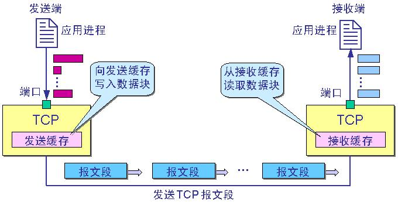

# 计算机网络体系结构

## 分组交换

### 电路交换

交换：按照某种方式动态分配传输路线资源

电路交换：经过“建立连接（占用资源）→通话（一直占用资源）→释放连接（归还资源）”这三个步骤的交换方式

在通话的全部时间内，通话的两个用户始终占用端到端的通信资源

### 分组交换

分组交换采用存储转发技术。

报文就要发送的整块数据，首先把报文划分为几个`分组`后再进行传送，每个分组通常是等长的，分组由`首部`和`数据`组成。

路由器的主要功能是进行分组交换。路由器接收到一个分组后，先暂存这个分组，然后就根据其头部中的目的地址转发给下一个路由器。（强调：路由器暂存的是一个个短分组，而不是整个的长报文）

只有当分组正在某链路上传送时，该链路才被占用。

*OSI：Open Systems Interconnection Reference Model*

在计算机网络中要做到有条不紊的交换数据，就必须遵守一些事先约定后的规则。这些规则明确规定了所交换的数据的格式以及有关的同步问题。为进行网络中的数据交换而建立的规则、标准或约定称为**网络协议**。

协议注意有3个要素：

1. 语法：规定数据格式
2. 语义：规定控制信息、动作及响应
3. 同步：规定事件的执行顺序

网络协议分层有利于独立性、复用性、可维护性等，**计算机网络的各层及其协议的集合**就是网络的**体系结构。**体系结构是抽象的，具体的实现是真正运行的软件和硬件。

## 五层协议概述

结合互联网的情况，自上而下地，简要的介绍一下各层的作用。

### 1 应用层

**应用层(application-layer）的任务：通过应用进程间的交互来完成特定网络应用。**

1. 应用层协议定义的是应用进程（进程：主机中正在运行的程序）间的通信和交互的规则。
2. 不同的网络应用需要不同的应用层协议。在互联网中应用层协议很多，如**域名系统DNS协议**，**HTTP协议**，支持电子邮件的**SMTP协议**等等。
3. 应用层交互数据单元称为报文。

### 2 运输层

**运输层(transport layer)的任务：负责向两台主机进程之间的通信提供通用的数据传输服务**

1. 应用进程利用运输层传送应用层报文，多种应用可以使用同一个运输层服务。
2. 运输层有复用和分用的功能。
   复用指多个应用层进程可同时使用下面运输层的服务；分用指运输层把收到的信息分别交付上面的应用层进程。

运输层主要使用以下两种协议

1. **传输控制协议TCP**（Transmisson Control Protocol）--提供**面向连接**的，**可靠的**数据传输服务。其数据传输单位是**报文段(segment)**。
2. **用户数据协议UDP**（User Datagram Protocol）--提供**无连接**的，尽最大努力的数据传输服务（**不保证数据传输的可靠性**）。其数据传输单位是**用户数据报**。

#### TCP的主要特点

1. TCP是面向连接的。（就好像打电话一样，通话前需要先拨号建立连接，通话结束后要挂机释放连接）；
2. 每一条TCP连接只能有两个端点，每一条TCP连接只能是点对点的（一对一）；
3. TCP提供可靠交付的服务。通过TCP连接传送的数据，无差错、不丢失、不重复、并且按序到达；
4. TCP提供全双工通信。TCP允许通信双方的应用进程在任何时候都能发送数据。TCP连接的两端都设有发送缓存和接收缓存，用来临时存放双方通信的数据；
5. 面向字节流。TCP中的“流”（stream）指的是流入进程或从进程流出的字节序列。“面向字节流”的含义是：虽然应用程序和TCP的交互是一次一个数据块（大小不等），但TCP把应用程序交下来的数据仅仅看成是一连串的无结构的字节流。

#### UDP的主要特点

1. UDP是无连接的；
2. UDP使用尽最大努力交付，即不保证可靠交付，因此主机不需要维持复杂的链接状态（这里面有许多参数）；
3. UDP是面向报文的；
4. UDP没有拥塞控制，因此网络出现拥塞不会使源主机的发送速率降低（对实时应用很有用，如IP电话，实时视频会议等）；
5. UDP支持一对一、一对多、多对一和多对多的交互通信；
6. UDP的首部开销小，只有8个字节，比TCP的20个字节的首部要短。

### 3 网络层

**网络层(network layer)的任务：为分组交换网上的不同主机提供通信服务。**

在TCP/IP体系结构中，由于网络层使用**IP协议**，因此分组也叫**IP数据报**，简称**数据报**。

1. 网络层运输层产生的报文段或用户数据报封装成分组和包进行传送。
2. 网络层选择合适的路由，使源主机运输层所传下来的分组，能通过网络层中的路由器找到目的主机。
3. 互联网的网络层也叫做**网际层**或**IP层**。

### 4 数据链路层

**数据链路层(data link layer)通常简称为链路层。**

两台主机之间的数据传输，总是在一段一段的链路上传送的，这就需要使用专门的链路层的协议.在两个相邻节点之间传送数据时，**数据链路层将网络层交下来的IP数据报组装成帧**，在两个相邻节点间的链路上传送帧。每一帧包括数据和必要的控制信息（如同步信息，地址信息，差错控制等）。

1. 在接收数据时，控制信息使**接收端能知道一个帧从哪个比特开始和到哪个比特结束**。
   这样，数据链路层在收到一个帧后，就可从中提出数据部分，上交给网络层。 
2. 控制信息还使**接收端能够检测到所收到的帧中有误差错。**
   如果发现差错，数据链路层就简单地丢弃这个出了差错的帧，以避免继续在网络中传送下去白白浪费网络资源；如果需要改正数据在链路层传输时出现差错（这就是说，数据链路层不仅要检错，而且还要纠错），那么就要采用可靠性传输协议来纠正出现的差错。这种方法会使链路层的协议复杂些。

### 5 物理层

在物理层上所传送的数据单位是比特。**物理层(physical layer)的作用是实现相邻计算机节点之间比特流的透明传送，尽可能屏蔽掉具体传输介质和物理设备的差异。**使其上面的数据链路层不必考虑网络的具体传输介质是什么。“透明传送比特流”表示经实际电路传送后的比特流没有发生变化，对传送的比特流来说，这个电路好像是看不见的。

*最后来一张很吊但是看过也记不住的图*

## 链路层

## 网络层---IP地址

## 运输层---TCP/UDP

IP协议把数据报文送到目的主机，但是并没有交付给主机的具体应用进程；而端到端的通信是应用进程之间的通信。

UDP，在传送数据前不需要先建立连接，远地的主机在收到UDP报文后也不需要给出任何确认。虽然UDP不提供可靠交付，但是正是因为这样，省去和很多的开销，使得它的速度比较快，比如一些对实时性要求较高的服务，就常常使用的是UDP。对应的应用层的协议主要有 DNS,TFTP,DHCP,SNMP,NFS 等。

TCP，提供面向连接的服务，在传送数据之前必须先建立连接，数据传送完成后要释放连接。因此TCP是一种可靠的的运输服务，但是正因为这样，不可避免的增加了许多的开销，比如确认，流量控制等。对应的应用层的协议主要有 SMTP,TELNET,HTTP,FTP 等。

### 常见应用层默认端口号及其传输层协议

| 应用程序   | FTP    | HTTP | DNS  | SMTP | TFTP | TELNET | SSH  | MYSQL |
| ---------- | ------ | ---- | ---- | ---- | ---- | ------ | ---- | ----- |
| 默认端口号 | 21, 20 | 80   | 53   | 25   | 69   | 23     | 22   | 3306  |
| 传输层协议 | TCP    | TCP  | UDP  | TCP  | UDP  | TCP    |      |       |

### TCP概述

1. 每一条TCP连接都有2个端点，这个端点叫作套接字（socket），它的定义是`IP地址:端口号`，假如IP地址为192.3.4.16，端口号为80，那么套接字为192.3.4.16:80。
2. 在一个TCP连接中，仅有两方进行彼此通信。广播和多播不能用于TCP。
3. TCP协议采用自适应的超时及重传策略。
4. TCP对字节流的内容不作任何解释。对字节流的解释由TCP连接双方的应用层解释。
5. TCP将应用数据被分割其成认为最适合发送的数据块，称为报文段或段。TCP的接收端丢弃重复数据，对收到的数据进行重新排序，将收到的数据以正确的顺序交给应用层。

#### TCP发送流程

#### TCP报文段格式

| 字段             | 大小     | 解释                                                         |
| ---------------- | -------- | ------------------------------------------------------------ |
| 源端口和目的端口 | 2字节    | 分别写入源端口和目的端口。                                   |
| 序号             | 4字节    | TCP连接中传送的数据流中的每一个字节都被编上一个序号。序号字段的值则指的是本报文段所发送的数据的第一个字节的序号。 |
| 确认号           | 4字节    | 是期望收到对方下一个报文的第一个数据字节的序号。 例如，B收到了A发送过来的报文，其序列号字段是501，而数据长度是200字节，这表明B正确的收到了A发送的到序号700为止的数据。因此，B期望收到A的下一个数据序号是701，于是B在发送给A的确认报文段中把确认号置为701。 |
| 数据偏移         | 4bit     | 指出TCP报文的数据距离TCP报文段的起始处有多远。               |
| 保留             | 6bit     | 保留今后使用，但目前应都位0。                                |
| URG              | 1bit     | 紧急。告诉系统此报文段中有紧急数据。                         |
| ACK              | 1bit     | 确认。只有ACK=1时，确认号才有效。                            |
| PSH              | 1bit     | 推送。当两个应用进程进行交互式通信时，有时在一端的应用进程希望在键入一个命令后立即就能收到对方的响应，这时候就将PSH=1。 |
| RST              | 1bit     | 复位。当RST＝1时，表明TCP连接中出现严重差错（如由于主机崩溃或其他原因），必须释放连接，然后再重新建立运输连接。 |
| SYN              | 1bit     | 同步。在连接建立时用来同步序号。同步比特SYN置为1，就表示这是一个连接请求或连接接受报文。 |
| FIN              | 1bit     | 终止。用来释放连接。当FIN=1，表明此报文的发送方的数据已经发送完毕，并且要求释放。 |
| 窗口             | 2字节    | 控制对方发送的数据量。TCP连接的一端根据设置的缓存空间大小确定自己的接收窗口大小，然后通知对方以确定对方的发送窗口的上限。 |
| 检验和           | 2字节    | 校验首部和数据。                                             |
| 紧急指针         | 2字节    | 指出在本报文段中的紧急数据的最后一个字节的序号。             |
| 选项             | 长度可变 | TCP首部可以有多达40字节的可选信息，用于把附加信息传递给终点，或用来对齐其它选项。 |
| 填充             | 长度可变 | 为了使整个首部长度是4字节的整数倍。                          |

### TCP为什么要3次握手

假设AB通信，AB都要确认双方通信的通道畅通

第一次握手：A → B，B接收成功，B确认A → B是通的

第二次握手：B → A，A接收成功，同时A知道B第一次握手成功了，A确认A → B和B → A都是通的

第三次握手：A → B，A告诉B第二次握手成功了，B接收成功，B确认B → A是通的