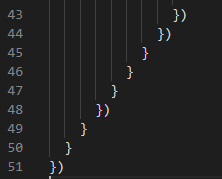

# 异步解决方案

分别用回调、promise和async操作一波：

读取本地一个叫“testDir”的文件夹，判断是不是文件夹，如果是文件夹就读取里面的所有文件，在这些文件中有一个叫"github"的，里面存的是github的一个json的url地址，然后读取这个json文件的内容。

[代码地址](https://github.com/JiWeiZ/FEMap/tree/master/codes/async)

## 回调

```js
const fs = require('fs')
const path = require('path')
const https = require('https')
const {targetPath} = require('./config')
let dirPath = path.join(__dirname, targetPath)

fs.stat(dirPath, (err, stats) => {
  if (err) {
    console.log(`发生错误：\n${err}`)
    return
  } else {
    if (stats.isDirectory()) {
      console.log(`${targetPath} is a dircectory`)
      fs.readdir(dirPath, (err, files) => {
        if (err) {
          console.log(`发生错误：\n${err}`)
          return
        } else {
          console.log(files)
          for (let i = 0; i < files.length;i++) {
            if (files[i] === "github") {
              let file = files[i]
              fs.readFile(path.join(dirPath, file), 'utf-8', (err, content) => {
                if (err) {
                  console.log(`发生错误：\n${err}`)
                  return
                }
                console.log(content)
                https.get(content, (res) => {
                  if (res.statusCode >= 400) {
                    console.log(`获取数据失败：错误代码：${res.statusCode}`)
                  } else {
                    var response = ""
                    res.on('data', (data) => {
                      response += data
                    })
                    res.on('end', () => {
                      console.log(response)
                    })
                  }
                }).on('error',err => {
                  console.log(`发生错误：\n${err}`)
                })
              })
            }
          }
        }
      })
    }
  }
})

```

呵，回调地狱




## Promise

要用promise的话需要对回调包装一下

```js
// promisify.js
const fs = require('fs')
const https = require('https')

function promisify_fs (fn) {
  return function (args) {
      return new Promise((resolve, reject) =>
          fn(args, (err, data) =>  err ? reject(err) : resolve(data))
      )
  }
}

function promisify_Get (fn) {
  return function (url) {
      return new Promise((resolve, reject) =>
          fn(url, res => {
            if (res.statusCode >= 400) {
              reject(`获取数据失败：错误代码：${res.statusCode}`)
            } else {
              resolve(res)
            }
          })
      )
  }
}

const stat = promisify_fs(fs.stat)
const readDir = promisify_fs(fs.readdir)
const readFile = promisify_fs(fs.readFile)
const httpsGet = promisify_Get(https.get)

module.exports = {
  stat,
  readDir,
  readFile,
  httpsGet
}

```

然后使用这些promise

```js
const path = require('path')
const { stat, readDir, readFile, httpsGet } = require('./promisify')
const { targetPath } = require('./config')
let dirPath = path.join(__dirname, targetPath)

stat(dirPath)
  .then(stats => {
    if (stats.isDirectory()) {
      console.log(`${targetPath} is a dircectory`)
      return readDir(dirPath)
    }
  })
  .then(files => {
    console.log(files)
    for (let i = 0; i < files.length; i++) {
      if (files[i] === 'github') {
        let file = files[i]
        return readFile(path.join(dirPath, file))
      }
    }
  })
  .then(content => {
    content = content.toString()
    console.log(content)
    return httpsGet(content)
  })
  .then(res => {
    var response = ""
    res.on('data', (data) => {
      response += data
    })
    res.on('end', () => {
      console.log(response)
    })
  })
  .catch(e => {
    console.log(e)
  })

```

### 顺序执行Promise

[代码地址](https://github.com/JiWeiZ/FEMap/blob/master/codes/async/promise_serial_execution.js)

我们知道Promise.all()执行promise是并行执行的，下面的代码读取testDir文件夹下的所有文件，并打印其内容。通过时间戳可以验证Promise.all()确实是并行执行的：

```js
const path = require('path')
const fs = require('fs')
const { readDir } = require('./promisify')
const { targetPath } = require('./config')
let dirPath = path.join(__dirname, targetPath)

function promisify_read(fn) {
  return function (args) {
    return new Promise((resolve, reject) =>
      fn(args, (err, data) => {
        if (err) {
          reject(err)
        } else {
          setTimeout(() => resolve(data), 3000)
        }
      })
    )
  }
}

let readFile = promisify_read(fs.readFile)

// Promise.all()：并行执行
readDir(dirPath)
  .then(files => {
    console.log(files)
    let tasks = files.map(file => readFile(path.join(dirPath, file)))
    Promise.all(tasks)
      .then(data => 
        data.forEach(data => console.log(`file内容：${data.toString()}时间戳：${Date.now()}`)))
  })
```

如果我想顺序执行promise，或者说串行执行，应该怎么办呢？我们还是利用前面的那个testDir，读取该文件夹下的所有文件，间隔3s依次打印文件内容。其实很简单，只要不断使用then就可以：

```js
readDir(dirPath)
    .then(files => {
    console.log(files)
    Promise.resolve()
        .then(() => readFile(path.join(dirPath, files[0])))
        .then(data => console.log(`file内容：${data.toString()}时间戳：${Date.now()}`))
        .then(() => readFile(path.join(dirPath, files[1])))
        .then(data => console.log(`file内容：${data.toString()}时间戳：${Date.now()}`))
        .then(() => readFile(path.join(dirPath, files[2])))
        .then(data => console.log(`file内容：${data.toString()}时间戳：${Date.now()}`))
        .then(() => readFile(path.join(dirPath, files[3])))
        .then(data => console.log(`file内容：${data.toString()}时间戳：${Date.now()}`))
})
```

上面那样写了很多then让人不爽，所以我们可以使用循环简化一下。为了说清楚循环的机制我们先手写一下循环的过程：

```js
readDir(dirPath)
    .then(files => {
    console.log(files)
    let tasks = files.map(file => readFile.bind(null, path.join(dirPath, file)))
    Promise.resolve()
        .then(tasks[0])
        .then(data => console.log(`file内容：${data.toString()}时间戳：${Date.now()}`))
        .then(tasks[1])
        .then(data => console.log(`file内容：${data.toString()}时间戳：${Date.now()}`))
        .then(tasks[2])
        .then(data => console.log(`file内容：${data.toString()}时间戳：${Date.now()}`))
        .then(tasks[3])
        .then(data => console.log(`file内容：${data.toString()}时间戳：${Date.now()}`))
})
```

注意这里的tasks，不能写成

```js
let tasks = files.map(file => readFile（path.join(dirPath, file)))
```

这么写的话tasks是一个状态全部都是pending的promise，readFile已经被调用了；tasks应该是一个函数集合，等到前一个readFile执行完以后后一个readFile才被执行。所以要bind一下。

然后用reduce完成循环就可以了：

```js
// 以下方法串行执行
readDir(dirPath)
    .then(files => {
    console.log(files)
    let tasks = files.map(file => readFile.bind(null, path.join(dirPath, file)))
    tasks.reduce((p, c) =>
	  p
      .then(c)
      .then(data => console.log(`file内容：${data.toString()}时间戳：${Date.now()}`))
      , Promise.resolve())
})
```

最后可以给顺序执行的部分封装成一个函数，贴一下完整代码：

```js
// promise_serial_execution.js

const path = require('path')
const fs = require('fs')
const { readDir } = require('./promisify')
const { targetPath } = require('./config')
let dirPath = path.join(__dirname, targetPath)

function promisify_read(fn) {
  return function (args) {
    return new Promise((resolve, reject) =>
      fn(args, (err, data) => {
        if (err) {
          reject(err)
        } else {
          setTimeout(() => resolve(data), 3000)
        }
      })
    )
  }
}

let readFile = promisify_read(fs.readFile)

function PromiseSerial(tasks, fn) {
  tasks.reduce((p, c) => p.then(c).then(data => fn(data)), Promise.resolve())
}

// 以下方法串行执行
readDir(dirPath)
  .then(files => {
    console.log(files)
    let tasks = files.map(file => readFile.bind(null, path.join(dirPath, file)))
    PromiseSerial(tasks, data =>
      console.log(`file内容：${data.toString()}时间戳：${Date.now()}`))
  })
```

## async/await

异步解决的终极方案大概就是async/await了

```js
const path = require('path')
const { stat, readDir, readFile, httpsGet } = require('./promisify')
const { targetPath } = require('./config')
let dirPath = path.join(__dirname, targetPath)

async function asyncFn(dirPath) {
  try {
    let stats = await stat(dirPath)
    if (stats.isDirectory()) {
      console.log(`${targetPath} is a dircectory`)
      let files = await readDir(dirPath)
      console.log(files)
      for (let i = 0; i < files.length; i++) {
        if (files[i] === 'github') {
          var file = files[i]
          break;
        }
      }
      let content = await readFile(path.join(dirPath, file))
      content = content.toString()
      console.log(content)
      let res = await httpsGet(content)
      var response = ""
      res.on('data', (data) => {
        response += data
      })
      res.on('end', () => {
        console.log(response)
      })
    }
  } catch (e) {
    console.log(e)
  }
}
asyncFn(dirPath)
```

## generator

实际上使用generator可以模拟async/await实现

```js
const path = require('path')
const { stat, readDir, readFile, httpsGet } = require('./promisify')
const { targetPath } = require('./config')
let dirPath = path.join(__dirname, targetPath)

function* asyncFn(dirPath) {
  try {
    let stats = yield stat(dirPath)
    if (stats.isDirectory()) {
      console.log(`${targetPath} is a dircectory`)
      let files = yield readDir(dirPath)
      console.log(files)
      for (let i = 0; i < files.length; i++) {
        if (files[i] === 'github') {
          var file = files[i]
          break;
        }
      }
      let content = yield readFile(path.join(dirPath, file))
      content = content.toString()
      console.log(content)
      let res = yield httpsGet(content)
      var response = ""
      res.on('data', (data) => {
        response += data
      })
      res.on('end', () => {
        console.log(response)
      })
    }
  } catch (e) {
    console.log(e)
  }
}

function autoRun (gen) {
  var iter = gen()
  function nextRun(data) {
    var result = iter.next(data)
    if (result.done) return result.value
    result.value.then(data => nextRun(data))
  }
  nextRun()
}

asyncFn = asyncFn.bind(null, dirPath)
autoRun(asyncFn)
```

