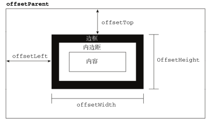
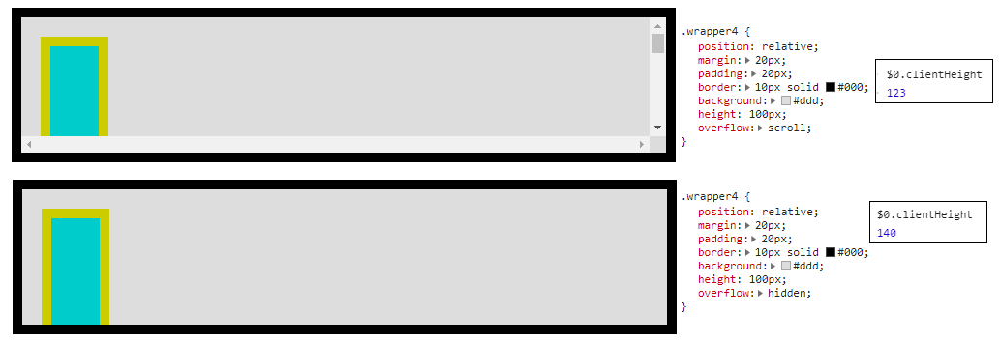
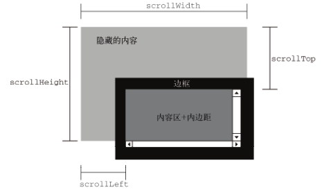

# 页面各种距离

## offset



1. e.offsetParent：元素的包含块。<br/>但是这么说的前提是e的position属性不是fixed，如果e是position: fixed，那么e.offsetParent是null。然后前面还介绍过，transform, filter和perspective可以改变position: fixed或absolute元素的包含块：

<iframe width="100%" height="250" src="//jsfiddle.net/happysir/joymxh1b/3/embedded/html,css,result/" allowfullscreen="allowfullscreen" allowpaymentrequest frameborder="0"></iframe>

​	虽然这个时候包含块已经是wrapper了，但是经测试，fixed的offsetParent仍是null

2. offsetTop：元素**border box**到offsetParent的**content box**的距离。<br/>但是这对于上面demo示例的那种情况不适用，上面那种情况是到包含块的border box的距离。我猜测原来嘛e的定位是相对于视口的，而视口本身没有border，现在虽然改变了包含块，但是offsetParent仍然是null，所以不适用。

3. offsetLeft：类似offsetTop
4. offsetHeight：元素border box的高度
5. offsetWidth：元素border box的宽度

## client

1. clientTop：等于border-top
2. clientLeft：等于border-left
3. clientHeight：
   1. overflow不是scroll：content box的高度，即padding-top + height + padding-bottom
   2. overflow是scroll：正常情况下的content box的高度减去滚动条的高度
4. clientWidth：类似clientHeight

```html
<style>
    .wrapper4 {
        position: relative;
        margin: 20px;
        padding: 20px;
        border: 10px solid #000;
        background: #ddd;
        height: 100px;
        overflow: scroll;
        // overflow: hidden;
    }

    .inner4 {
        position: relative;
        border: 10px solid #cc0;
        height: 500px;
        width: 50px;
        background: #0cc;
        top: 10px;
        left: 0;
    }
</style>
<div class="wrapper4">
    <div class="inner4"></div>
</div>
```



*clientHeight说白了就是 background的高度*


## scroll

只有当元素设置overflow: scroll下列值才有意义



1. scrollHeight：隐藏内容总高度
2. scrollWidth：隐藏内容总宽度
3. scrollTop：scrollTop的取值范围为 [0, scrollHeight - clientHeight]
4. scrollLeft：scrollLeft的取值范围为 [0, scrollWidth - clientWidth]

<div class="outer" style="
            margin: 20px;
            padding: 20px;
            border: 10px solid #000;
            background: #ddd;
            height: 100px;
            overflow: scroll;
            ">
    <div class="inner" style="
                margin: 10px;
                border: 10px solid #cc0;
                padding: 10px;
                height: 500px;
                width: 50px;
                background: #0cc;
                "></div>
</div>

```html
<div class="outer" style="
            margin: 20px;
            padding: 20px;
            border: 10px solid #000;
            background: #ddd;
            height: 100px;
            overflow: scroll;
            ">
    <div class="inner" style="
                margin: 10px;
                border: 10px solid #cc0;
                padding: 10px;
                height: 500px;
                width: 50px;
                background: #0cc;
                "></div>
</div>
```

使用JS调整滚动条高度的时候一定是调整设置overflow: scroll的那个元素，不是设置overflow: scroll包裹的那个元素。也就是说，调outer.scrollTop，不是调inner.scrollTop

### 页面滚动条

如果没有声明\<!DOCTYPE HTML>，浏览器会使用怪异模式，怪异模式下使用`document.body.scrollTop`确定滚动条高度

正常声明\<!DOCTYPE HTML>的，使用`document.documentElement.scrollTop`

## window

1. window.innerHeight
2. window.innerWidth

## 鼠标指针坐标

1. event.clientX / event.clientY：<br/>以当前窗口的左上角为参考点
2. event.screenX / event.screenY：<br/>以用户整个电脑屏幕的左上角为参考点
3. event.offsetX / event.offsetY：<br/>以e.target的content-box的左上角为参考点，如果有boder，可能出现负值。
4. event.layerX / event.layerY **（IE8以及以下版本没有）**：
   1. 如果没有设置绝对定位或相对定位，以页面为参考点，此时等于clientX
   2. 如果有，以e.target的border-box的左上角为参考点
5. event.layerX / event.layerY **（IE8以及以下版本没有）**：<br/>相对于文档左上角，不是窗口左上角
6. event.x / event.y：相对与可视区域

```js
document.onclick = function(e){
    e = e || window.event;
    console.log(`e.clientX = ${e.clientX}, e.clientY = ${e.clientY}`);
    console.log(`e.screenX = ${e.screenX}, e.screenY = ${e.screenY}`);
    console.log(`e.layerX = ${e.layerX}, e.layerY = ${e.layerY}`);
    console.log(`e.pageX = ${e.pageX}, e.pageY = ${e.pageY}`);
    console.log(`e.x= ${e.x}, e.y = ${e.y}`);
}
```

