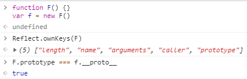

# 对象相关

## typeof和instanceof

typeof只显示6个值，显示结果是字符串："undefined", "boolean", "string", "number", "object", "function"

## 对象继承

### 一切都是对象

在JavaScript这门语言中，获取对象的唯一途径就是克隆，而JavaScript中的根对象是Object.prototype，我们遇到的每一个对象实际上都是从这个Object.prototype克隆而来的。但我们并不需要关系克隆的细节，因为这是引擎内部负责实现的，我们只需要调用var obj1 = new Object()或者var obj2 = {}，内部引擎就会从Object.prototype上克隆一个对象出来。可以这么说：在JavaScript中，除了基本类型，一切都是对象。

我们先来看一下下面这个2行代码

```javascript
function F() {}
var f = new F()
```

这段简单的代码包含了好几个概念：

1. 构造函数
2. prototype属性
3. constructor属性
4. \_\_proto\_\_属性
5. new操作符

#### 构造函数

所谓的构造函数其实就是普通的函数，叫作构造函数仅仅是告诉我们：这个函数将来是被用作创建对象的。

#### prototype属性

在JavaScript中，每一个函数都有天然的拥有5个属性：length, name, arguments, caller, prototype。



*PS: 几个获取对象属性名的 API*

```js
Object.keys(obj) 					// 获取obj的属性名（无法获取Symbol属性）
Object.getOwnPropertyNames(obj)     // 获取obj的属性名（无法获取Symbol属性）
Object.getOwnPropertySymbols(obj)   // 获取obj的Symbol属性名
Reflect.ownKeys(obj)  				// 获取obj所有类型的键名，包括常规键名和 Symbol 键名。
```

#### constructor属性

函数的prototype属性指向一个对象，这个对象在创建函数的时候自动生成，并且拥有一个constructor属性，constructor属性指向这个函数。

在上面的那2行代码中，f是构造函数F()生成的对象，通过设置构造函数的prototype实现原型继承的时候，除了根对象Object.prototype，任何对象都有一个内部属性[[Prototype]]，它指向这个构造函数的原型。

#### _\_proto\_\_ 属性

当调用构造函数创建一个新实例后，该实例的内部将包含一个指针（内部属性） ，指向构造函数的原型对象。ECMA-262 第 5 版中管这个指针叫 [[Prototype]] 。虽然在脚本中没有标准的方式访问 [[Prototype]] ，但 Firefox、Safari 和 Chrome 在每个对象上都支持一个属性\_\_proto\_\_ ；而在其他实现中，这个属性对脚本则是完全不可见的。*——《 javaScript高级程序设计（第三版）P148 》*


但是现在_\_proto\_\_属性已在ES6中标准化，现在更推荐使用Object.getPrototypeOf/Reflect.getPrototypeOf 和Object.setPrototypeOf/Reflect.setPrototypeOf来读写[[Prototype]]。

\_\_proto\_\_的读取器(getter)暴露了一个对象的内部 [[Prototype]] ：

1. 对于使用对象字面量创建的对象，这个值是 Object.prototype。
2. 对于使用数组字面量创建的对象，这个值是 Array.prototype。
3. 对于functions，这个值是Function.prototype。
4. 对于使用 new fun 创建的对象，其中fun是由js提供的内建构造器函数之一(Array, Boolean, Date, Number, Object, String 等等），这个值总是fun.prototype。
5. **对于用js定义的其他js构造器函数创建的对象，这个值就是该构造器函数的prototype属性。**（这是最常见的形式）

\_\_proto\_\_ 的设置器(setter)只接受object和null作为参数。并且_\_proto\_\_ 的设置器(setter)允许更改对象的 [[Prototype]]前提是这个对象是可扩展的。（即可以为对象**添加**新的属性，对象的\_\_proto\_\_  属性可以被更改。）即：

```js
Object.isExtensible(obj) === true
```

默认情况下，对象是可扩展的。Object.preventExtensions，Object.seal 或 Object.freeze 方法都可以标记一个对象为不可扩展（non-extensible）。

```js
// 新对象默认是可扩展的.
var empty = {};
Object.isExtensible(empty); // === true

// ...不可扩展.
Object.preventExtensions(empty);
Object.isExtensible(empty); // === false

// 密封对象是不可扩展的.
var sealed = Object.seal({});
Object.isExtensible(sealed); // === false

// 冻结对象也是不可扩展.
var frozen = Object.freeze({});
Object.isExtensible(frozen); // === false
```

## new操作符

new操作符做了什么事情呢？通过new调用构造函数实际上经历了4步：

1. 创建一个新对象
2. 将this指向这个新对象
3. **执行构造函数（为新对象添加属性）**<br/> （这就是为什么使用new来实现继承会导致额外的构造函数调用）
4. 返回这个对象

为了理解new操作符，我们自己动手模拟一个new

```js
function Point(x, y) {
    this.x = x
    this.y = y
}

Point.prototype.getLength = function () {
    let {x, y} = this
    return Math.sqrt(x * x + y * y)
}

function defineClass(initializer) {
    return function f(...args) {
        f.prototype = initializer.prototype    // 确保instanceof正确
        let obj = Object.create(initializer.prototype)  //创建一个新队对象
        initializer.apply(obj, args)    // 将this指向这个对象，并执行构造函数
        return obj    // 返回这个对象
    }
}

var p1 = defineClass(Point)(3, 4)
var p2 = new Point(5, 12)
console.log([p1.x, p1.y, p1.getLength(), p1 instanceof Point])
console.log([p2.x, p2.y, p2.getLength(), p2 instanceof Point])
// [3, 4, 5, true]
// [5, 12, 13, true]
```

## Object.create()

语法

```
Object.create(proto, [propertiesObject])
```

参数

1. proto：新创建对象的原型对象
2. propertiesObject：可选。设置要添加到新创建对象上的属性。propertiesObject的属性名是新增属性的名字，属性值是新增属性的描述符，对应Object.defineProperties()的第二个参数

#### 例子

```js
var root = {rootProp: 'foo'}
var obj = Object.create(root, {
    objProp: {
        configurable: true, 
        enumerable: true, 
        wriable: true, 
        value: 'bar'}
    }
)
```


#### 额外的构造器调用

```javascript
function Point (components) {
    console.log('Point constructor called')
    this.components = components
}

Point.prototype.getDimension = function () {
    return this.components.length
}

Point.prototype.getLength = function () {
    let sum = 0, components = this.components
    for (let i = 0; i < components.length; i++) {
        sum += components[i] ** 2
    }
    return Math.sqrt(sum)
}

function Point2D (x, y) {
    Point.call(this, [x, y])
}

Point2D.prototype = new Point()
Point2D.prototype.getXY = function () {
    let {components} = this
    return {
        x: components[0],
        y: components[1]
    }
}

var p = new Point2D(3, 4)
console.log(p, p.getLength(), p instanceof Point)
// Point constructor called
// Point constructor called
// Point2D {components: Array(2)}components: (2) [3, 4]__proto__: Point 5 true
```

"Point constructor called"被打印了2次说明构造函数Point被调用了2次，原因是第22行代码使用了new实现继承，而new操作符会调用构造函数，导致额外的构造函数调用

**解决方法是使用Object.create来实现继承**

```javascript
function Point (components) {
    console.log('Point constructor called')
    this.components = components
}

Point.prototype.getDimension = function () {
    return this.components.length
}

Point.prototype.getLength = function () {
    let sum = 0, components = this.components
    for (let i = 0; i < components.length; i++) {
        sum += components[i] ** 2
    }
    return Math.sqrt(sum)
}

function Point2D (x, y) {
    Point.call(this, [x, y])
}

// Point2D.prototype = new Point()
Point2D.prototype = Object.create(Point.prototype)
Point2D.prototype.getXY = function () {
    let {components} = this
    return {
        x: components[0],
        y: components[1]
    }
}

var p = new Point2D(3, 4)
console.log(p, p.getLength(), p instanceof Point)
// Point constructor called
// Point2D {components: Array(2)} 5 true
```

自己动手实现一个Object.create

```js
function clone (o) {
    function F(){}
    F.prototype = o
    return new F()
}
```

#### Object.setPrototypeOf

​        Object.setPrototypeOf可以替代Object.create

​        但是由于现代 JavaScript 引擎优化属性访问所带来的特性的关系，更改对象的 [[Prototype]]在各个浏览器和 JavaScript 引擎上都是一个很慢的操作。这不仅仅限于 obj.__proto__ = ... 语句上的时间花费，而且可能会延伸到可以访问[[Prototype]]被更改的对象的代码。如果你关心性能，你应该避免设置一个对象的 [[Prototype]]。使用 Object.create()来创建带有你想要的[[Prototype]]的新对象。

```js
// Point2D.prototype = Object.create(Point.prototype)
Object.setPrototypeOf(Point2D.prototype, Point.prototype)
```

#### 如何创建没有原型的对象

通过设置构造函数的prototype实现原型继承的时候，除了根对象Object.prototype，任何对象都有一个内部属性[[Prototype]]。

如何创建没有原型的对象呢？通过Object.create(null)就可以实现。

```javascript
let obj = Object.create(null)    // obj没有原型对象
```

## 对象深拷贝

### 1. 递归

停止递归的条件：① 该属性是函数 ② 该属性是基本类型（暂且认为不是对象就是基本类型）

```js
  function deepClone(obj) {
    if (typeof obj === 'function') {
      return function (...args) {
        return obj.apply(this, args)
      }
    } else if (!obj || typeof obj !== 'object') {
      return obj
    }
    let _obj = new obj.constructor()
    Object.keys(obj).forEach(key => _obj[key] = deepClone(obj[key]))
    return _obj
  }
```

测试：

```js
  function People(contry, name, age) {
    this.contry = contry
    this.name = name
    this.hobby = ['music', 'sports', 'reading']
    this.age = age
  }

  People.prototype.sayContry = () => { console.log(`I'm from ${this.contry}`) }

  var father = new People('China', 'old John', 50)
  father.sayName = function () {
    console.log(`my name is ${this.name}`)
  }
  var son = new People('China', 'little John', 30)
  var wife = new People('US', 'Cristina', 30)
  father.son = son
  son.wife = wife

  var f1 = deepClone(father)
  console.log(f1.sayName === father.sayName)
```

### 2. JSON序列化

```js
var deepClone = (obj) => JSON.parese(JSON.stringfy(obj))
```

### 3. Object.assign()

只进行一层深拷贝

```js
let obj2 = Object.assign({}, obj1)
```

## 不屏蔽原型链上的属性值

设置属性值的writable为false即可。

**在调用 Object.defineProperty() 方法时，如果不指定， configurable 、 enumerable 和writable 特性的默认值都是 false** 。如果调用Object.defineProperty() 方法只是修改已定义的属性，则无此限制。

### 示例1

```js
function Car () {
}
Object.defineProperty(Car.prototype, 'color', {
    value: 'white',
    writable: false
})
var car = new Car ();
car.color = 'black';
console.log(car.color); // white
```

### 示例2

```js
function Person () {
}
Object.defineProperties(Person.prototype, {
    _age: {
        value: 1
    },
    age: {
        get: function() {
            return this._age;
        },
        set: function(val) {
            this._age = val;
        }
    }
})
var a = new Person ();
var b = new Person ();
a.age = 2;
console.log(a._age); //1
```

