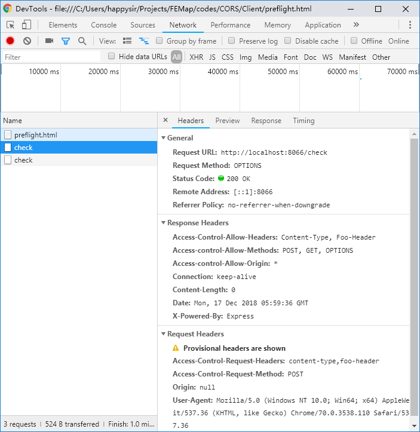
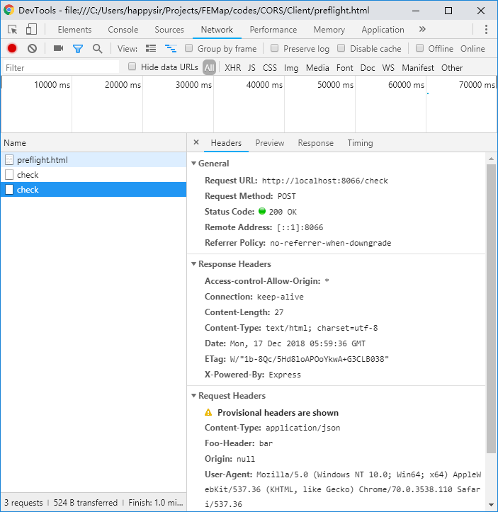

# 跨域

## 简单请求

某些请求不会触发 CORS 预检请求。本文称这样的请求为“简单请求”，请注意，该术语并不属于 Fetch （其中定义了 CORS）规范。若请求满足所有下述条件，则该请求可视为“简单请求”：

使用下列方法之一：

- GET
- HEAD
- POST

Fetch 规范定义了`对 CORS 安全的首部字段集合`，不得人为设置该集合之外的其他首部字段。该集合为：

- Accept
- Accept-Language
- Content-Language
- Content-Type ，仅限于下列三个：
  - text/plain
  - multipart/form-data
  - application/x-www-form-urlencoded
- DPR
- Downlink
- Save-Data
- Viewport-Width
- Width
- 请求中的任意XMLHttpRequestUpload 对象均没有注册任何事件监听器；XMLHttpRequestUpload 对象可以使用 XMLHttpRequest.upload 属性访问。
- 请求中没有使用 ReadableStream 对象。

[参考 MDN：简单请求](https://developer.mozilla.org/zh-CN/docs/Web/HTTP/Access_control_CORS#%E7%AE%80%E5%8D%95%E8%AF%B7%E6%B1%82)

## 简单请求的跨域

只需要处理2个字段：请求头Origin和响应头Access-Control-Allow-Origin

## 预检

如果不是简单请求，浏览器默认会使用`OPTIONS`方法发起一个预检请求到服务器，以获知服务器是否允许该实际请求。

对于预检请求，服务端需要处理3个字段：

1. Access-control-Allow-Origin
2. Access-control-Allow-Methods
3. Access-Control-Allow-Headers

### 示例

前端使用application/json传数据，并且还传了个自定义的请求头Foo-Header，显然这不是简单请求

```html
<!DOCTYPE html>
<html lang="en">
<head>
  <meta charset="UTF-8">
  <meta name="viewport" content="width=device-width, initial-scale=1.0">
  <meta http-equiv="X-UA-Compatible" content="ie=edge">
  <title>Document</title>
</head>

<body>
  <div>
    <input type="text" id="inputCode">
    <button id="button">发送</button>
    <span id="tips">还未发送</span>
  </div>
</body>
<script>
  function check(code) {
    const xhr = new XMLHttpRequest(),
      method = 'POST',
      url = `http://localhost:8066/check`,
      data = JSON.stringify({ code })
    xhr.open(method, url)
    xhr.onreadystatechange = function () {
      if (xhr.readyState === 4 && xhr.status === 200) {
        tips.innerHTML = xhr.responseText
      }
    }
    xhr.setRequestHeader('Content-Type', 'application/json')
    xhr.setRequestHeader('Foo-Header', 'bar')
    xhr.send(data)
  }
  button.addEventListener('click', function () {
    let code = inputCode.value
    check(code)
  })
</script>

</html>

```


服务端用express，这个时候必须处理预检请求

```js
const express = require('express')
const app = express()
const bodyParser = require('body-parser')
app.use(bodyParser.json({"limit": "2048kb"}))
app.use(express.json());
// bodyParser.urlencoded 用来解析 request 中 body的 urlencoded字符，
// 只支持utf-8的编码的字符,也支持自动的解析gzip 和 zlib.
// 返回的对象是一个键值对，当extended为false的时候，键值对中的值就为
// 'String'或'Array'形式，为true的时候，则可为任何数据类型。
app.use(bodyParser.urlencoded({ extended: false }));

app.options('/check', function (req, res) {
    res.setHeader('Access-control-Allow-Origin', '*')
    res.setHeader('Access-control-Allow-Methods', 'POST, GET, OPTIONS')
    res.setHeader('Access-Control-Allow-Headers', 'Content-Type, Foo-Header')
    res.end()
})

app.post('/check', function (req, res) {
    let checkCode = req.body.code
    res.setHeader('Access-control-Allow-Origin', '*')
    res.send(`接收到前端数据：${checkCode}`)
})

app.listen(8066, () => console.log(`Sever running at 8066`))

```






可以看到客户区发了2次请求，一次请求方法是OPTIONS，一次是POST