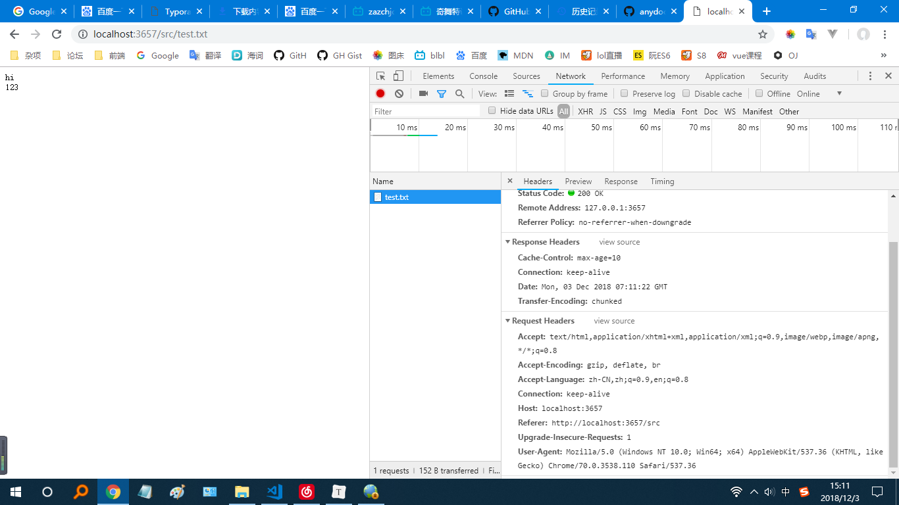
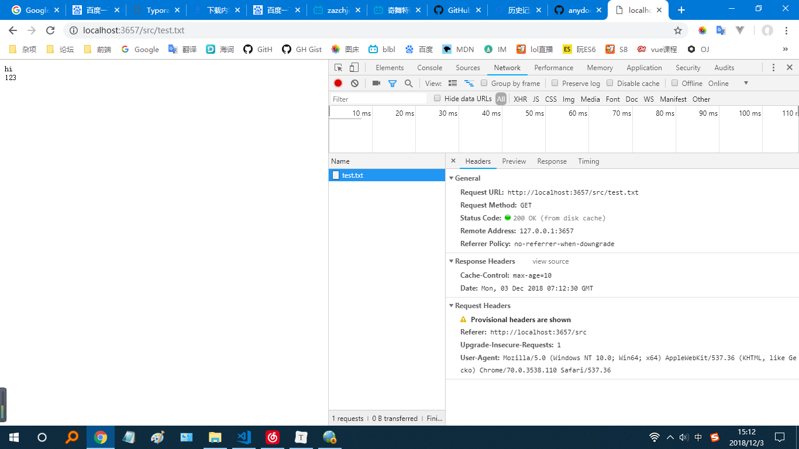
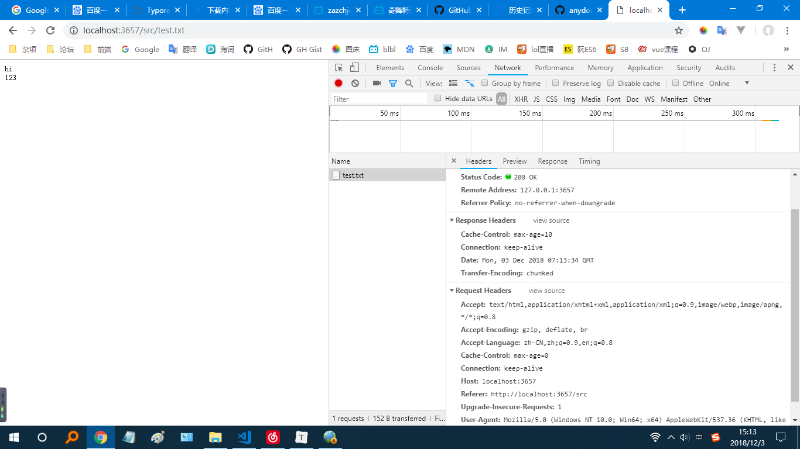
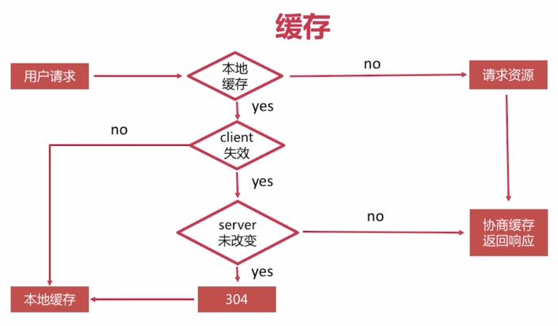

# 缓存策略

HTTP的缓存策略主要有2种，一种叫强缓存，一种叫协商缓存

## 强缓存

强缓存主要使用expires和cache-control请求头来设定一个过期时间。在这个过期时间之内客户端不会向服务端发起请求而是直接使用本地缓存。客户端压根就不会发送请求，并且如果在过期时间内服务器更新了资源，客户端是不会看到更新资源的。

1. expires是比较老的一个头，使用的是绝对时间；cache-control使用相对时间，现在大部分使用的是cache-control。
2. 强缓存的资源，如一张图片，在刷新的时候是不会发起请求的，但是直接输入图片的url每次都会发起请求获取最新资源
3. 避免强缓存的办法很简单，只要动态修改资源的src就可以了。即使服务器不采用强缓存，但是因为网络服务商可能采取缓存策略，所以要完全避免缓存可以在前端动态修改src。
4. **使用强缓存，用户点击浏览器的刷新按钮是可以拿到最新数据的（浏览器此时会发送cache-control: no-cache或者是cache-control: max-age=0）**

这里起了一个静态资源服务器，如果是目录就显式目录下的资源，如果是文件就显式文件内容

```js
const http = require('http')
const fs = require('fs')
const path = require('path')
const chalk = require('chalk')
const Handlebars = require('handlebars')
const promisify = require('util').promisify
const readdir = promisify(fs.readdir)
const stat = promisify(fs.stat)

const { port, hostname, root } = require('./config')
const cache = require('./cache')
const tplPath = path.join(__dirname, './dir.tpl')
const source = fs.readFileSync(tplPath)
const template = Handlebars.compile(source.toString())
let i = 1

const server = http.createServer(async function (req, res) {
  console.log(`接受了${i++}次http请求`)
  const filePath = path.join(root, req.url)
  try {
    const stats = await stat(filePath)
    if (stats.isDirectory()) {
      const files = await readdir(filePath)
      if (files) {
        res.statusCode = 200
        res.setHeader('Content-Type', 'text/html')
        const dir = path.relative(root, filePath)
        const data = {
          files,
          title: path.basename(filePath),
          dir: dir ? `/${dir}` : ''
        }
        res.end(template(data))
      }
    } else if (stats.isFile()) {
      // res.setHeader('Expires', new Date(Date.now() + 600000))
      res.setHeader('Cache-Control', "max-age=10")
      fs.createReadStream(filePath).pipe(res)
    }
  } catch (e) {
    res.statusCode = 404
    res.setHeader('Content-Type', 'text/plain')
    res.write(`${e.toString()}\n`)
    res.end(`${filePath} is not a directory or file`)
  }

})

server.listen(port, hostname, () => {
  const addr = `http://${hostname}:${port}`
  console.log(`Server started at ${chalk.green(addr)}`)
})

```

Cache-Control和Expires选一个就行，现在大部分都是Cache-Control，max-age以秒为单位



status code是200

在10s之内打开文件不会发送http请求



status code是200，后面还有一句from disk cache，说明是从本地缓存加载的

如果使用F5刷新来请求，则会重新发请求



注意请求头里面加了`Cache-Control: max-age=0`，所以会发起http请求

## 协商缓存

协商缓存主要使用2个请求头，一个是`If-Modified-Since`，这个头通常配合`Last-Modified`响应头使用，`Last-Modified`的值是一个日期；另一个是`If-None-Match`，这个头配合`etag`响应头使用，`etag`的值是一个字符串，并且规定必须使用双引号包裹。

```js
module.exports = function checkCache(stats, req, res) {
  const stasmTime = stats.mtime.toUTCString()
  res.setHeader('Last-Modified', stasmTime)
  res.setHeader('Etag', `"${stasmTime}abcd"`)
  const LastModified = req.headers['if-modified-since']
  const Etag = req.headers['if-none-match']
  if (!LastModified && !Etag) {
    return false
  } else if (LastModified && LastModified !== res.getHeader('Last-Modified')) {
    return false
  } else if (Etag && Etag !== res.getHeader('Etag')) {
    return false
  } else {
    return true
  }
}
```

这里etag就随便写一个值，etag可以是文件的一个哈希，或者uuid什么的，只要是一个字符串就以，当服务器资源发生改变可以改变就可以


*csdn一个 JS资源的 etag*

然后在main.js中调用checkCache

```js
...
    } else if (stats.isFile()) {
      res.setHeader('Content-Type', mime(filePath))
      // res.setHeader('Expires', new Date(Date.now() + 600000))
      res.setHeader('Cache-Control', "max-age=10")
      const isCache = checkCache(stats, req, res)
      if (isCache) {
        res.statusCode = 304
        res.end()
      } else {
        res.statusCode = 200
        fs.createReadStream(filePath).pipe(res)
      }
    }
...
```

图示总结一下大概就是这个意思：



最后附上源代码：https://github.com/JiWeiZ/FEMap/tree/master/codes/Network/cache

## 浏览器的3种刷新方式

**1. 在地址栏中输入URL访问**

正常的缓存策略。对所有没有过期的内容直接使用本地缓存，从而减少了对浏览器的请求。

**2. 按F5或浏览器刷新按钮**

这个时候浏览器会在请求头里面加`Cache-Control: max-age=0`，从而禁用强缓存。

**3. 按Ctrl+F5或按Ctrl并点击刷新按钮**

这种方式就是强制刷新，浏览器不会发送`If-Modified-Since`请求头，也不会发`if-none-match`请求头，并且还会加上`Cache-Control: no-cache`和`Pragma: no-cache`，此时总会发起一个全新的请求，服务器不会使用任何缓存资源。