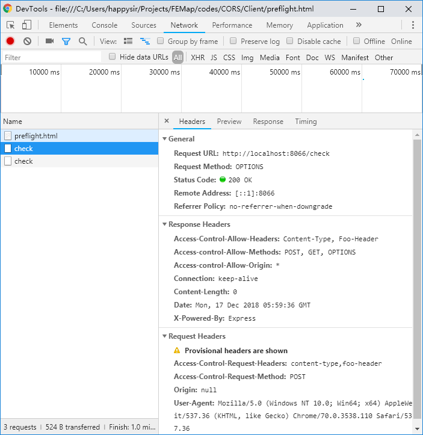

# 跨域解决方案

1. 图像ping
2. jsonp
3. CORS
4. document.domain + iframe
5. location.hash + iframe
6. window.name + iframe
7. postMessage
8. nginx代理
9. nodejs中间件代理
10. WebSocket

## 图像ping

动态img，同jsonp差不多，url跨域，但是只能get，而且没有回调，用于浏览器与服务器的单向通信，常用于广告统计访问量。

## JSONP

前端document.createElement('script')，动态插入src，并将callback作为query传过去。

```js
// 前端代码
let script = document.createElement('script')
script.src = "https://www.foo.com/bar?callback=handleJSONP"
document.body.insertBefore(script, document.body.firstChild)

function handleJSONP (res) {
    // deal with responce
}
```

后端需要这样处理JSONP请求

```js
let callback = req.query.callback
let sendData = `{"code": ${code_generator.code}, "expire": ${code_generator.expire}}`
let jsonp = `${callback}(${sendData})`
res.send(jsonp)
```

### 示例

利用JSONP实现协商轮询的例子

```html
<!DOCTYPE html>
<html lang="en">

<head>
    <meta charset="UTF-8">
    <meta name="viewport" content="width=device-width, initial-scale=1.0">
    <meta http-equiv="X-UA-Compatible" content="ie=edge">
    <title>Document</title>
    <style>
        div{
            margin: 10px;
            padding: 10px;
            border: 2px solid;
        }
        p {
            margin: 5px;
            padding: 5px;
            border: 1px solid;
        }
        span {
            margin: 5px;
        }
    </style>
</head>

<body>
    <div>
        <p id="time"></p>
        <p id="code"></p>
        <p>
            <input type="text" id="inputCode">
            <button id="button">发送</button>
            <span id="tips">还未发送</span>
        </p>
    </div>
</body>

<script>

    let code = document.querySelector("#code")
    let codePrevious, expire
    setInterval(() => {
        time.innerHTML = new Date().toLocaleString()
    }, 1000)

    function poll(res) {
        if (codePrevious !== res.code) {
            codePrevious = res.code
            code.innerHTML = codePrevious
            expire = parseInt(res.expire, 10)
            setTimeout(jsonp.bind(null, "http://localhost:8067/qrcode?callback=poll"), expire)
        }
    }

    function jsonp(src) {
        let scriptElemet = document.querySelector('#jsonp')
        if (scriptElemet) {
            let parent = scriptElemet.parentNode
            parent.removeChild(scriptElemet)
        }
        let script = document.createElement('script')
        script.src = src
        script.id = "jsonp"
        document.body.insertBefore(script, document.body.firstChild)
    }

    jsonp("http://localhost:8067/qrcode?callback=poll")

    function check(code) {
        const xhr = new XMLHttpRequest(),
            method = 'GET',
            url = `http://localhost:8067/check/${code}`
        xhr.onreadystatechange = function () {
            if (xhr.readyState === 4 && xhr.status === 200) {
                tips.innerHTML = xhr.responseText
            }
        }
        xhr.open(method, url)
        xhr.send(null)
    }

    button.onclick = () => check(inputCode.value)

</script>

</html>
```

服务端

```js
const express = require('express')
const app = express()

class CodeGenerator {
    constructor () {
        this.code = undefined
        this.previousCode = undefined
        this.expire = ('' + Math.random()).slice(-8)
    }
    check (code) {
        return code === this.code || code === this.previousCode ? '验证通过' : '验证不通过'
    }
    setNewCode () {
        this.code = ('' + Math.random()).slice(-8)
        setTimeout(() => this.previousCode = this.code, 2000)
    }
    update (time) {
        this.expire = time
        setInterval(() => this.setNewCode(), time)
    }
}

let code_generator = new CodeGenerator()
code_generator.update(5000)

app.get('/qrcode', function (req, res) {
    // 自己拼jsonp
    let callback = req.query.callback
    let sendData = `{"code": ${code_generator.code}, "expire": ${code_generator.expire}}`
    let jsonp = `${callback}(${sendData})`
    res.send(jsonp)

    // 使用express的jsonp函数
    // res.jsonp({code: code_generator.code, expire: code_generator.expire})
})

app.get('/check/:code', function (req, res) {
    let checkCode = req.params.code
    let msg = code_generator.check(checkCode)
    res.setHeader('Access-control-Allow-Origin', '*')
    res.send(msg)
})

app.listen(8067)

```


## CORS

### 简单请求

简单请求不会触发 CORS 预检。若请求满足所有下述条件，则该请求可视为“简单请求”：

使用下列方法之一：

- GET
- HEAD
- POST

Fetch 规范定义了`对 CORS 安全的首部字段集合`，不得人为设置该集合之外的其他首部字段。该集合为：

- Accept
- Accept-Language
- Content-Language
- Content-Type ，仅限于下列三个：
  - text/plain
  - multipart/form-data
  - application/x-www-form-urlencoded
- DPR
- Downlink
- Save-Data
- Viewport-Width
- Width
- 请求中的任意XMLHttpRequestUpload 对象均没有注册任何事件监听器；XMLHttpRequestUpload 对象可以使用 XMLHttpRequest.upload 属性访问。
- 请求中没有使用 ReadableStream 对象。

[参考 MDN：简单请求](https://developer.mozilla.org/zh-CN/docs/Web/HTTP/Access_control_CORS#%E7%AE%80%E5%8D%95%E8%AF%B7%E6%B1%82)

#### 处理简单请求

对于简单请求只需要处理2个字段：请求头Origin和响应头Access-Control-Allow-Origin

### 预检

如果不是简单请求，浏览器默认会使用`OPTIONS`方法发起一个预检请求到服务器，以获知服务器是否允许该实际请求。

对于预检请求，服务端必须需要处理3个字段：

1. Access-control-Allow-Origin
2. Access-control-Allow-Methods
3. Access-Control-Allow-Headers

还有1个可选字段：

1. Access-Control-Max-Age: 应该将这个预检请求缓存多长时间（单位：秒）

#### 示例

前端使用application/json传数据，并且还传了个自定义的请求头Foo-Header，显然这不是简单请求

```html
<!DOCTYPE html>
<html lang="en">
<head>
  <meta charset="UTF-8">
  <meta name="viewport" content="width=device-width, initial-scale=1.0">
  <meta http-equiv="X-UA-Compatible" content="ie=edge">
  <title>Document</title>
</head>

<body>
  <div>
    <input type="text" id="inputCode">
    <button id="button">发送</button>
    <span id="tips">还未发送</span>
  </div>
</body>
<script>
  function check(code) {
    const xhr = new XMLHttpRequest(),
      method = 'POST',
      url = `http://localhost:8066/check`,
      data = JSON.stringify({ code })
    xhr.open(method, url)
    xhr.onreadystatechange = function () {
      if (xhr.readyState === 4 && xhr.status === 200) {
        tips.innerHTML = xhr.responseText
      }
    }
    xhr.setRequestHeader('Content-Type', 'application/json')
    xhr.setRequestHeader('Foo-Header', 'bar')
    xhr.send(data)
  }
  button.addEventListener('click', function () {
    let code = inputCode.value
    check(code)
  })
</script>

</html>

```


服务端用express，这个时候必须处理预检请求

```js
const express = require('express')
const app = express()
const bodyParser = require('body-parser')
app.use(bodyParser.json({"limit": "2048kb"}))
app.use(express.json());
// bodyParser.urlencoded 用来解析 request 中 body的 urlencoded字符，
// 只支持utf-8的编码的字符,也支持自动的解析gzip 和 zlib.
// 返回的对象是一个键值对，当extended为false的时候，键值对中的值就为
// 'String'或'Array'形式，为true的时候，则可为任何数据类型。
app.use(bodyParser.urlencoded({ extended: false }));

app.options('/check', function (req, res) {
    res.setHeader('Access-control-Allow-Origin', '*')
    res.setHeader('Access-control-Allow-Methods', 'POST, GET, OPTIONS')
    res.setHeader('Access-Control-Allow-Headers', 'Content-Type, Foo-Header')
    res.end()
})

app.post('/check', function (req, res) {
    let checkCode = req.body.code
    res.setHeader('Access-control-Allow-Origin', '*')
    res.send(`接收到前端数据：${checkCode}`)
})

app.listen(8066, () => console.log(`Sever running at 8066`))

```




可以看到客户区发了2次请求，一次请求方法是OPTIONS，一次是POST

[代码地址](https://github.com/JiWeiZ/FEMap/tree/master/codes/CORS)

### 带凭据的请求

如果要传cookie、SSL证明等，前端需要设置

```js
xhr.withCredentials = true
```

服务器接受带凭据的请求，需设置响应头

```js
Access-Control-Allow-Credentials: true
```

### CORS头

#### 请求头

1. Origin
2. Access-Control-Request-Method
3. Access-Control-Request-Headers

#### 响应头

1. Access-Control-Allow-Origin
2. Access-Control-Allow-Headers
3. Access-Control-Allow-Methods
4. Access-Control-Max-Age
5. Access-Control-Allow-Credentials
6. Access-Control-Expose-Headers

在跨域访问时，XHR对象的getResponseHeader()方法只能拿到一些最基本的响应头，Cache-Control、Content-Language、Content-Type、Expires、Last-Modified、Pragma，如果要访问其他头，则需要服务器设置本响应头。

```javascript
// 这样浏览器就能够通过getResponseHeader访问Custom-Header和 Another-Custom-Header 响应头了。
res.setHeader('Access-Control-Expose-Headers', 'Custom-Header, Another-Custom-Header')

// 这样可以访问所有响应头
res.setHeader('Access-Control-Expose-Headers', '*')
```


[参考文章](https://segmentfault.com/a/1190000011145364)