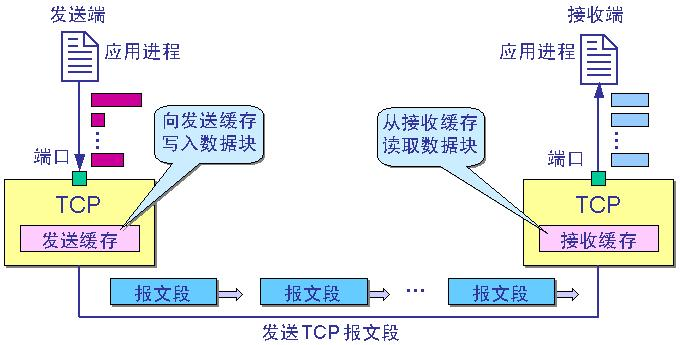
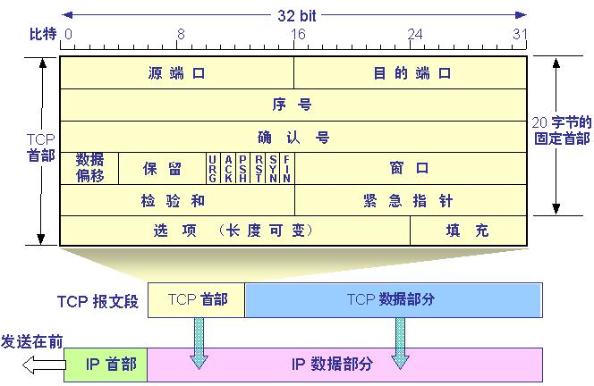
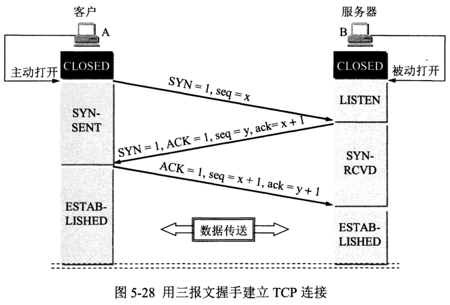
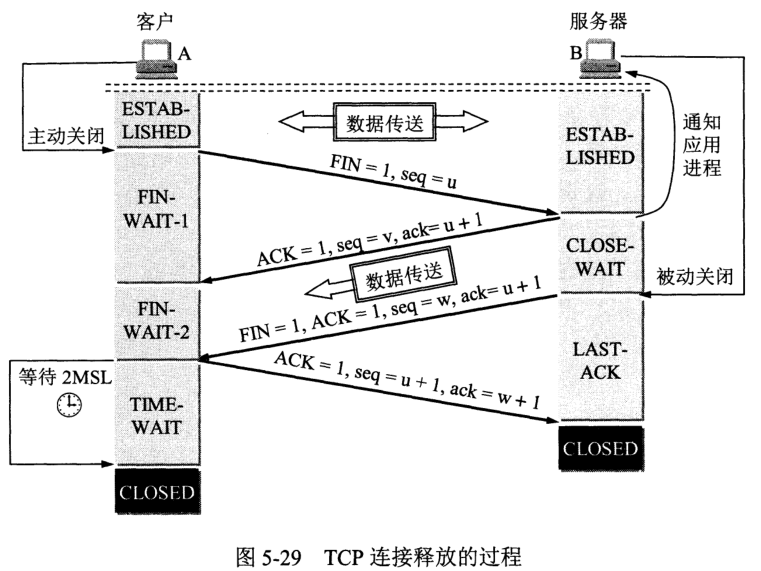
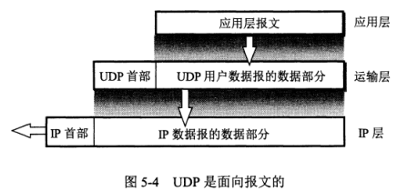
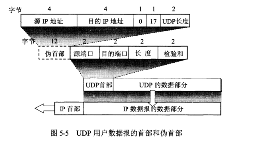

# 运输层

IP协议把数据报文送到目的主机，但是并没有交付给主机的具体应用进程；而端到端的通信是应用进程之间的通信。

UDP，在传送数据前不需要先建立连接，远地的主机在收到UDP报文后也不需要给出任何确认。虽然UDP不提供可靠交付，但是正是因为这样，省去和很多的开销，使得它的速度比较快，比如一些对实时性要求较高的服务，就常常使用的是UDP。对应的应用层的协议主要有 DNS,TFTP,DHCP,SNMP,NFS 等。

TCP，提供面向连接的服务，在传送数据之前必须先建立连接，数据传送完成后要释放连接。因此TCP是一种可靠的的运输服务，但是正因为这样，不可避免的增加了许多的开销，比如确认，流量控制等。对应的应用层的协议主要有 SMTP,TELNET,HTTP,FTP 等。

**常见应用层默认端口号及其传输层协议**

| 应用程序   | FTP    | HTTP | DNS  | SMTP | TFTP | TELNET | SSH  | MYSQL |
| ---------- | ------ | ---- | ---- | ---- | ---- | ------ | ---- | ----- |
| 默认端口号 | 21, 20 | 80   | 53   | 25   | 69   | 23     | 22   | 3306  |
| 传输层协议 | TCP    | TCP  | UDP  | TCP  | UDP  | TCP    |      |       |

## TCP概述

### TCP的特点

1. 每一条TCP连接都有2个端点，这个端点叫作套接字（socket），它的定义是`IP地址:端口号`，假如IP地址为192.3.4.16，端口号为80，那么套接字为192.3.4.16:80。
2. 在一个TCP连接中，仅有两方进行彼此通信。广播和多播不能用于TCP。
3. TCP协议采用自适应的超时及重传策略。
4. TCP对字节流的内容不作任何解释。对字节流的解释由TCP连接双方的应用层解释。
5. TCP将应用数据被分割其成认为最适合发送的数据块，称为报文段或段。TCP的接收端丢弃重复数据，对收到的数据进行重新排序，将收到的数据以正确的顺序交给应用层。

### TCP的发送流程

### TCP的报文段格式

| 字段             | 大小     | 解释                                                         |
| ---------------- | -------- | ------------------------------------------------------------ |
| 源端口和目的端口 | 2字节    | 分别写入源端口和目的端口。                                   |
| 序号seq          | 4字节    | TCP连接中传送的数据流中的每一个字节都被编上一个序号。序号字段的值则指的是本报文段所发送的数据的第一个字节的序号。 |
| 确认号ack        | 4字节    | 是期望收到对方下一个报文的第一个数据字节的序号。 例如，B收到了A发送过来的报文，其序列号字段是501，而数据长度是200字节，这表明B正确的收到了A发送的到序号700为止的数据。因此，B期望收到A的下一个数据序号是701，于是B在发送给A的确认报文段中把确认号置为701。 |
| 数据偏移         | 4bit     | 指出TCP报文的数据距离TCP报文段的起始处有多远。               |
| 保留             | 6bit     | 保留今后使用，但目前应都位0。                                |
| URG              | 1bit     | 紧急。告诉系统此报文段中有紧急数据。                         |
| ACK              | 1bit     | 确认。只有ACK=1时，确认号才有效。                            |
| PSH              | 1bit     | 推送。当两个应用进程进行交互式通信时，有时在一端的应用进程希望在键入一个命令后立即就能收到对方的响应，这时候就将PSH=1。 |
| RST              | 1bit     | 复位。当RST＝1时，表明TCP连接中出现严重差错（如由于主机崩溃或其他原因），必须释放连接，然后再重新建立运输连接。 |
| SYN              | 1bit     | 同步。在连接建立时用来同步序号。同步比特SYN置为1，就表示这是一个连接请求或连接接受报文。 |
| FIN              | 1bit     | 终止。用来释放连接。当FIN=1，表明此报文的发送方的数据已经发送完毕，并且要求释放。 |
| 窗口             | 2字节    | 控制对方发送的数据量。TCP连接的一端根据设置的缓存空间大小确定自己的接收窗口大小，然后通知对方以确定对方的发送窗口的上限。 |
| 检验和           | 2字节    | 校验首部和数据。                                             |
| 紧急指针         | 2字节    | 指出在本报文段中的紧急数据的最后一个字节的序号。             |
| 选项             | 长度可变 | TCP首部可以有多达40字节的可选信息，用于把附加信息传递给终点，或用来对齐其它选项。 |
| 填充             | 长度可变 | 为了使整个首部长度是4字节的整数倍。                          |

## TCP3次握手

1. 服务端先创建TCB（传输控制块），时刻准备接受客户端的连接请求，此时服务端进入了LISTEN（监听）状态
2. 客户端创建TCB，然后发送连接请求报文，首部中 SYN标志位为1，初始通讯序列号seq=x，进入SYN_SEND（同步已发送状态）状态。 SYN报文段（SYN=1的报文段）不携带数据，但需要消耗掉一个序号。
3. 服务端收到请求报文后，如果同意连接，则发出确认报文。其中 ACK=1，SYN=1，确认号是ack=x+1，同时为自己初始化一个序列号 seq=y，服务端进入了SYN-RCVD（同步收到）状态。 这个报文不携带数据，但是同样要消耗一个序号。
4. 客户端回传一个带ACK标志的确认报文。确认报文的ACK=1，ack=y+1，自己的序列号seq=x+1，此时客户端进入ESTABLISHED（已建立连接）状态。 因为ACK报文段的SYN不为1，可以携带数据，但是如果不携带数据则不消耗序号。
5. 双方都进入ESTABLISHED状态，就可以开始通信了。

三次握手的特点：

1. 前两次握手有同步信号SYN，后两次握手有确认信号ACK
2. 自己发送的序列号是seq，希望对方发送的序列号是ack
3. 握手时不携带数据但是要消耗1个序号

### TCP为什么要3次握手

假设AB通信，AB都要确认双方通信的通道畅通

第一次握手：A → B，B接收成功，B确认A → B是通的

第二次握手：B → A，A接收成功，同时A知道B第一次握手成功了，A确认A → B和B → A都是通的

第三次握手：A → B，A告诉B第二次握手成功了，B接收成功，B确认B → A是通的

问：为什么还要第3次握手呢？似乎二次握手之后A向B正常发送通信的内容，B接收到这个内容同样可以确定B → A是通的。

答：**防止失效连接请求报文段被服务端接受。**

假设有这样一种场景，客户端发送了第一个请求连接并且没有丢失，只是因为在网络结点中滞留的时间太长了，由于TCP的客户端迟迟没有收到确认报文，以为服务器没有收到，此时重新向服务器发送这条报文，此后客户端和服务器经过两次握手完成连接，传输数据，然后关闭连接。此时此前滞留的那一次请求连接，网络通畅了到达了服务器，这个报文本该是失效的，但是，两次握手的机制将会让客户端和服务器再次建立连接，这将导致不必要的错误和资源的浪费。

## TCP4次挥手

1. 客户端发送连接释放报文。客户端向接收端发送FIN=1，seq=u的报文段。客户端进入FIN-WAIT-1（终止等待1）状态。
   FIN报文段即使不携带数据，也要消耗一个序号。
2. 服务器收到FIN，发出ACK=1，ack=u+1的确认报文，并且带上自己的序列号seq=v，服务端就进入CLOSE-WAIT（关闭等待）状态。
3. 客户端收到服务器的确认请求后，此时，客户端就进入FIN-WAIT-2（终止等待2）状态，等待服务器发送连接释放报文。
4. 服务器将最后的数据发送完毕后，就向客户端发送连接释放报文，FIN=1，ack=u+1，由于在半关闭状态，服务器很可能又发送了一些数据，假定此时的序列号为seq=w，此时，服务器就进入了LAST-ACK（最后确认）状态，等待客户端的确认。
5. 客户端收到服务器的连接释放报文后，必须发出确认，ACK=1，ack=w+1，而自己的序列号是seq=u+1，此时，客户端就进入了TIME-WAIT（时间等待）状态。注意此时TCP连接还没有释放，必须经过2∗∗MSL（最长报文段寿命）的时间后，当客户端撤销相应的TCB后，才进入CLOSED状态。
6. 服务器只要收到了客户端发出的确认，立即进入CLOSED状态。同样，撤销TCB后，就结束了这次的TCP连接。可以看到，服务器结束TCP连接的时间要比客户端早一些。

### 为什么客户端最后还要等待2MSL？

MSL（Maximum Segment Lifetime），TCP允许不同的实现可以设置不同的MSL值。

假如不等的2MSL直接CLOSED：

1. 最后一个ACK报文丢失。这样服务端就一直接收不到ACK报文，就会一直重发FIN+ACK报文，永远不会停下来。等待2MSL能让客户端可以接收服务端重传的报文，给出回应，然后重启2MSL计时器
2. 最后一个ACK报文没有丢失，只是延迟。假如这时又建立新的连接，这个失效的ACK报文被接收以后会给服务端带来错误。等待2MSL就可以使本连接持续的时间内所产生的所有报文段都从网络中消失。这样新的连接中不会出现旧连接的请求报文。

### 如果已经建立了连接，但是客户端突然出现故障了怎么办？

TCP有一个保活计时器，每接收一次请求就重新计时，通常计时2小时，如果2小时之内仍为收到对方请求，服务端就每隔75分钟发一个探测报文，连发10个还没反应就关闭连接

## TCP连接：一个凄美的爱情故事

嗯，开脑洞玩

**第一章：三次握手**

​	——每一段感情的开始总是愉快的

客户端女神遇见了与服务端小哥，觉得小哥不错，伸出橄榄枝

1. 客户端：我们交往吧！（SYN = 1）
2. 服务端：好呀好呀！（ACK = 1）我们交往吧！（SYN = 1）
3. 客户端：好呀好呀！（ACK = 1）

于是他们愉快的聊了起来......

**第二章：四次挥手**

​	——舔狗多情，分手快乐

天下没有不散的宴席，终于有一天女神要分手了

1. 客户端：我们分手吧！（FIN = 1）
2. 服务端：我同意分手（ACK = 1），但是我还有些话想跟你说 blablabla...
3. 服务端：我说完了，分手吧（FIN = 1，ACK = 1）
4. 客户端：好的（ACK = 1） 客户端等待了会儿，关闭了连接，服务端收到这条消息以后，立马关闭了连接

## UDP概述

### UDP的特点

1. 无连接，不需要套接字
2. 不保证可靠交付
3. 面向报文：UDP一次交付一个完整报文
4. 无拥塞控制：网络拥塞时会丢数据，但不允许数据有太大时延。适合直播、语音通信等服务。
5. 支持一对一、一对多、多对多通信
6. 首部开销小：仅8字节，比TCP至少20个字节的首部短

### UDP的首部格式

| 字段     | 长度  | 解释                                            |
| -------- | ----- | ----------------------------------------------- |
| 源端口   | 2字节 | 源端口号。在需要对方回信时选用。不需要时可用全0 |
| 目的端口 | 2字节 | 目的端口号。                                    |
| 长度     | 2字节 | UDP用户数据报的长度，最小值是8字节（仅有首部）  |
| 检验和   | 2字节 | 检验UDP数据表是否有误，有误就丢弃               |

