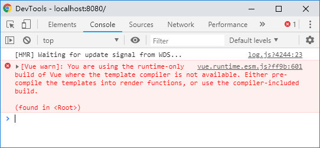

#  Vue源码（一）：渲染过程

## 简述

1. 第一步new Vue，执行初始化过程
2. 第二步挂载$mount方法，可以通过2种方式生成render函数
   1. 使用template，vue会将template解析成render函数
   2. 直接写render函数
3. 通过watcher监听数据变化
4. 当数据变化时，render函数执行生成VNode对象
5. 通过patch方法，对比新旧VNode对象，通过DOM Diff算法，改动真正的DOM元素

## new vue时发生了什么

问：一般用vue-cli创建vue项目的时候，会询问我们是使用Runtime + compiler构建vue还是Runtime only，这两者的区别是什么？

答：使用Runtime only版本构建的vue只能在.vue文件中使用template，不能在js文件里面new Vue的时候写template

<span style="background:red">下面的情况Runtime only是不允许的：</span>

```js
// main.js
import Vue from 'vue'
import App from './App'
import router from './router'

Vue.config.productionTip = false

/* eslint-disable no-new */
new Vue({
  el: '#app',
  router,
  // render: h => h(App),
  components: { App },
  template: '<App/>'
})

```



## vue的初始化过程

在 web 应用下，我们来分析 Runtime + Compiler 构建出来的 Vue.js，它的入口是 `src/platforms/web/entry-runtime-with-compiler.js`

1. src\platforms\web\entry-runtime-with-compiler.js
   1. 重新定义$mount方法
2. src\platforms\web\runtime\index.js
   1. 安装platform相关的一些utils，运行时指令和组件
   2. 挂\_\_patch\_\_方法
   3. 挂$mount方法
3. src\core\index.js
   1. 初始化全局API
      1. 定义Vue全局属性config
      2. 全局方法util
      3. 全局方法set， delete，nextTick
      4. 初始化全局属性options
      5. 给Vue.options添加components，directives，filtes
      6. 定义Vue.options._base = Vue
      7. 添加内置组件，目前就一个keep-alive
      8. 全局方法use
      9. 全局方法mixin
      10. 全局方法extend
      11. 全局方法component，directive，filter（这就说明了为什么既可以使用Vue.component定义全局组件，也可以在组件内部使用components定义局部组件）
4. src\core\instance\index.js
   1. vue的定义在这里，执行_init()方法
   2. 执行5个mixin：
      1. initMixin（初始化）：挂_init()方法
      2. stateMixin（状态）：挂$set, $delete, $watch方法
      3. eventsMixin（事件）：挂$on, $once, $off, $emit方法
      4. lifecycleMixin（声明周期）：挂_update, $forceUpate, $destroy方法
      5. renderMixin（渲染）：挂$nextTick，_render方法

## 渲染过程

Vue是一个类，vue源码在src\core\instance\index.js定义了这个类，然后就会执行this._init(options)方法

```js
// src\core\instance\index.js
function Vue (options) {
  if (process.env.NODE_ENV !== 'production' &&
    !(this instanceof Vue)
  ) {
    warn('Vue is a constructor and should be called with the `new` keyword')
  }
  this._init(options)
}
```

this.\_init方法是在initMixin中挂上去的，this.\_init主要做了下面的工作：

1. 定义uid

2. 合并options，将传入的options给merge到$options上

3. 挂vm._renderProxy，如果是生成环境就是vm，不然就执行一下initProxy(vm)

4. 一堆初始化函数：
   1. <br>
   ```js
   initLifecycle(vm)
   initEvents(vm)
   initRender(vm)
   callHook(vm, 'beforeCreate')
   initInjections(vm) // resolve injections before data/props
   initState(vm)
   initProvide(vm) // resolve provide after data/props
   callHook(vm, 'created')
   ```

5. 如果有el对象就用$mount挂载el，这个$mount执行之前，dom对象还没有渲染，一旦执行完页面上就有真实的dom对象了。$mount就是做挂载的方法，是下面要重点分析的方法


## data的属性是如何挂到vue实例上的？

我们new Vue的时候会进行vue的初始化工作，Vue实际上是一个类，new的时候会执行\_init方法，执行\_init的时候会执行initState，初始化data就是在initState的时候做的。实际上initState主要做了下面的工作：

1. 初始化props
2. 初始化methods
3. 初始化data
4. 初始化computed
5. 初始化watch

下面主要分析initData

1. 首先获取options上的data，然后判断类型，是函数就执行getData一下，然后赋给vm.\_data
2. 判断一下，props和methods的变量不能和data上的变量同名
3. 通过proxy(vm, \`_data\`, key)实现data属性挂到vue实例上

下面主要分析proxy，代码很少，贴一下：

```js
export function proxy (target: Object, sourceKey: string, key: string) {
  sharedPropertyDefinition.get = function proxyGetter () {
    return this[sourceKey][key]
  }
  sharedPropertyDefinition.set = function proxySetter (val) {
    this[sourceKey][key] = val
  }
  Object.defineProperty(target, key, sharedPropertyDefinition)
}
```

很简单，定义一个vm.key，这是一个访问器属性，和vm.\_data.key相关联

## $mount方法详解

Vue 中我们是通过 `$mount` 实例方法去挂载 `vm` 的，`$mount` 方法在多个文件中都有定义，如 `src/platform/web/entry-runtime-with-compiler.js`、`src/platform/web/runtime/index.js`、`src/platform/weex/runtime/index.js`。因为 `$mount` 这个方法的实现是和平台、构建方式都相关的。接下来我们重点分析带 `compiler` 版本的 `$mount` 实现

`compiler` 版本的 `$mount` 实现是在src\platforms\web\entry-runtime-with-compiler.js中定义的，做了下面几件事：

1. 处理el，保证el是一个dom并且不是body和html
2. 处理没有定义render的情况，也就是将template解释为render函数，vue里面所有组件最终都被转成了render方法
   1. 处理template，确保得到是组件的outerHTML
   2. 把template编译为render函数
3. call一下之前缓存的mount

src\platforms\web\entry-runtime-with-compiler.js中就是处理了没写render函数的情况


下面看看runtime-only版本的$mount，他的定义实际上在src\platforms\web\runtime\index.js中

```js
// public mount method
Vue.prototype.$mount = function (
  el?: string | Element,
  hydrating?: boolean
): Component {
  el = el && inBrowser ? query(el) : undefined
  return mountComponent(this, el, hydrating)
}
```

mountComponent方法的定义在src\core\instance\lifecycle.js中，

1. vm.$el = el，这个时候挂了$el，这个时候就能获取dom了实际上

2. 处理vm.$options.render的空的情况

   1. vm.$options.render赋值空VNode
   2. 发警告

3. 调用beforeMount

4. 定义updateComponent方法，主要内容如下：<br/>

   ```js
   updateComponent = () => {
     vm._update(vm._render(), hydrating)
   }
   ```

   vm._render返回一个VNode，vm.\_update是在lifecycleMixin的时候挂上去的，在何时的时候更新这个VNode

5. 实例化watcher，这个updateComponent最终会在watcher的回调中调用，有2种情况会调用这个回调，一个是初始化的时候另一个是 vm 实例中的监测的数据发生变化的时候

6. 调用mounted

## 虚拟DOM的实现过程

vm._render方法返回一个VNode，即虚拟DOM

```js
// src\core\instance\render.js
Vue.prototype._render = function (): VNode {
  const vm: Component = this
  const { render, _parentVnode } = vm.$options

  if (_parentVnode) {
    vm.$scopedSlots = _parentVnode.data.scopedSlots || emptyObject
  }

  // set parent vnode. this allows render functions to have access
  // to the data on the placeholder node.
  vm.$vnode = _parentVnode
  // render self
  let vnode
  try {
    vnode = render.call(vm._renderProxy, vm.$createElement)
  } catch (e) {
    handleError(e, vm, `render`)
    // return error render result,
    // or previous vnode to prevent render error causing blank component
    /* istanbul ignore else */
    if (process.env.NODE_ENV !== 'production' && vm.$options.renderError) {
      try {
        vnode = vm.$options.renderError.call(vm._renderProxy, vm.$createElement, e)
      } catch (e) {
        handleError(e, vm, `renderError`)
        vnode = vm._vnode
      }
    } else {
      vnode = vm._vnode
    }
  }
  // return empty vnode in case the render function errored out
  if (!(vnode instanceof VNode)) {
    if (process.env.NODE_ENV !== 'production' && Array.isArray(vnode)) {
      warn(
        'Multiple root nodes returned from render function. Render function ' +
        'should return a single root node.',
        vm
      )
    }
    vnode = createEmptyVNode()
  }
  // set parent
  vnode.parent = _parentVnode
  return vnode
}
```

去掉现在不care的部分

```js
// src\core\instance\render.js
Vue.prototype._render = function (): VNode {
  const vm: Component = this
  const { render, _parentVnode } = vm.$options
	...
  let vnode
  try {
    vnode = render.call(vm._renderProxy, vm.$createElement)
  } catch (e) {...}
  ...
  return vnode
}
```

vm.$options中的render函数前面说了，可以是自己写的，也可以是编译生成的，然后主要就是调用render函数。

```js
let vnode
  try {
    vnode = render.call(vm._renderProxy, vm.$createElement)
  } catch (e) {...}
```

vm._renderProxy生产环境就是vm，开发环境可能是一个代理对象，等会介绍

### vm.$createElement

vm.$createElement是一个函数，这个是在哪里挂上去的呢，实际上是在initRender的时候干的

```js
export function initRender (vm: Component) {
  vm._vnode = null // the root of the child tree
  ...
  vm._c = (a, b, c, d) => createElement(vm, a, b, c, d, false)
  vm.$createElement = (a, b, c, d) => createElement(vm, a, b, c, d, true)
}
```

主要vm.\_c和vm.$createElement都是执行createElement方法，只不过一个是false一个是true，俩有什么区别呢，vm.\_c是被template编译的render执行的，vm.$createElement是用户自己写的render执行的。

createElement函数会在后面介绍

**BTW：**挂载的元素会替换掉原来的元素，比如我这么写：

```html
...
<div id="app"></div>
...
```

```js
var app = new Vue({
  el: '#app',
  render(createElement) {
    return createElement('div', {
      attrs: {id: 'app1'}
    }, this.message)
  },
  data () {
    return {
      message: 'Hello'
    }
  }
})
```

然后我页面上的#app的div就会被覆盖的，最终的结果是

```html
...
<div id="app1">Hello</div>
...
```

### vm._renderProxy

vm.\_renderProxy是在this.\_init的时候挂上去的

```js
  Vue.prototype._init = function (options?: Object) {
    ...
    if (process.env.NODE_ENV !== 'production') {
      initProxy(vm)
    } else {
      vm._renderProxy = vm
    }
    ...
  }
```

initProxy的定义是在src\core\instance\proxy.js里，通过ES6的Proxy实现数据劫持，在开发的时候能报警告

## createElement

createElement在src\core\vdom\create-element.js中

createElement函数本身没有执行创建VNode的逻辑，仅仅是对输入参数做了一个处理，允许data是可选参数，createElement实际上返回的是\_createElement的执行结果

```js
return _createElement(context, tag, data, children, normalizationType)
```


```js
export function _createElement (
  context: Component,
  tag?: string | Class<Component> | Function | Object,
  data?: VNodeData,
  children?: any,
  normalizationType?: number
): VNode | Array<VNode> {
  ... 
  if (normalizationType === ALWAYS_NORMALIZE) {
    children = normalizeChildren(children)
  } else if (normalizationType === SIMPLE_NORMALIZE) {
    children = simpleNormalizeChildren(children)
  }
  let vnode, ns
  if (typeof tag === 'string') {
    let Ctor
    ns = (context.$vnode && context.$vnode.ns) || config.getTagNamespace(tag)
    if (config.isReservedTag(tag)) {
      // platform built-in elements
      vnode = new VNode(
        config.parsePlatformTagName(tag), data, children,
        undefined, undefined, context
      )
    } else if ((!data || !data.pre) && isDef(Ctor = resolveAsset(context.$options, 'components', tag))) {
      // component
      vnode = createComponent(Ctor, data, context, children, tag)
    } else {
      // unknown or unlisted namespaced elements
      // check at runtime because it may get assigned a namespace when its
      // parent normalizes children
      vnode = new VNode(
        tag, data, children,
        undefined, undefined, context
      )
    }
  } else {
    // direct component options / constructor
    vnode = createComponent(tag, data, context, children)
  }
  if (Array.isArray(vnode)) {
    return vnode
  } else if (isDef(vnode)) {
    if (isDef(ns)) applyNS(vnode, ns)
    if (isDef(data)) registerDeepBindings(data)
    return vnode
  } else {
    return createEmptyVNode()
  }
}
```

手写render函数的时候传的第3个参数是


## \_update

mountComponent的核心语句是

```js
updateComponent = () => {
  vm._update(vm._render(), hydrating)
}
```

通过vm.\_render()我们拿到了虚拟DOM，然后通过vm.\_update渲染到真实DOM上

vm.\_update和mountComponent都是在src/core/instance/lifecycle.js中定义的，执行vm.\_update的时机有2个，一个是初始化render的时候，一个是更新数据的时候

```js
if (!prevVnode) {
  // initial render
  vm.$el = vm.__patch__(vm.$el, vnode, hydrating, false /* removeOnly */)
} else {
  // updates
  vm.$el = vm.__patch__(prevVnode, vnode)
}
```

vm.\_\_patch\_\_是在src/platform/web/runtime/index.js中定义的，vm.\_\_patch\_\_方法和平台相关，如果是浏览器环境是patch函数，否则是noop，因为vue是可以运行在服务端的。

patch函数在src/platform/web/runtime/patch.js中定义，是由在src/core/vdom/patch.js中定义的createPatchFunction生成的。createPatchFunction是一个高阶函数，返回一个patch函数

所以饶了一圈，上面的vm.\_\_patch\_\_实际上是createPatchFunction返回的结果，所以我们把目光聚焦于createPatchFunction

createPatchFunction接收2个参数，一个是nodeOps，一个是modules，nodeOps对原生JS操作，modules定义了一些模块的钩子函数，暂时不看

### createPatchFunction

createPatchFunction在src\core\vdom\patch.js，这个函数比较大，有700多行

首先初始化相关钩子函数

为什么Vue要把patch绕一大圈定义在这里呢？实际上他是用了一个叫函数柯里化的技巧，

nodeOps和modules都是和平台相关的，实际上是一个适配器模式

createPatchFunction返回的patch函数接收4个参数，然后我的项目里的main.js是这么写的：

```js
var app = new Vue({
  el: '#app',
  render (createElement) {
    return createElement('div', {
      attrs: {
        id: 'app'
      }
    }, this.message)
  },
  data () {
    return {
      message: 'Hello Vue'
    }
  }
})
```

我们调用patch的时候，实际上执行的是vm.\_\_patch\_\_

```js
vm.$el = vm.__patch__(vm.$el, vnode, hydrating, false)
```

对应定义时的patch

```js
function patch (oldVnode, vnode, hydrating, removeOnly)
```

我们认为这个oldVnode就是vm.$el，是一个真实的DOM，vnode是一个虚拟DOM

对于上面的情形，会在下面执行

```js
oldVnode = emptyNodeAt(oldVnode)
```

这会儿oldVnode就是一个虚拟dom


