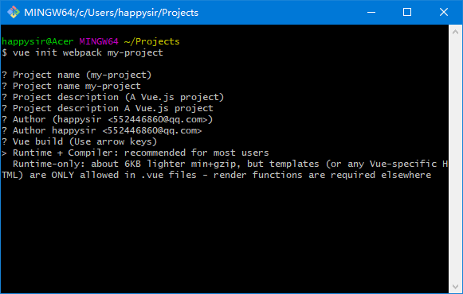

Runtime Only和Runtime+Compiler的区别：

当我们使用vue-cli的时候会询问

```bash
? Vue build (Use arrow keys)
> Runtime + Compiler: recommended for most users
  Runtime-only: about 6KB lighter min+gzip, but templates (or any Vue-specific H
TML) are ONLY allowed in .vue files - render functions are required elsewhere
```
Runtime Only：运行时不带编译，编译是在离线的时候做（啥意思？）

Runtime+Compiler：可以不对代码做预编译



